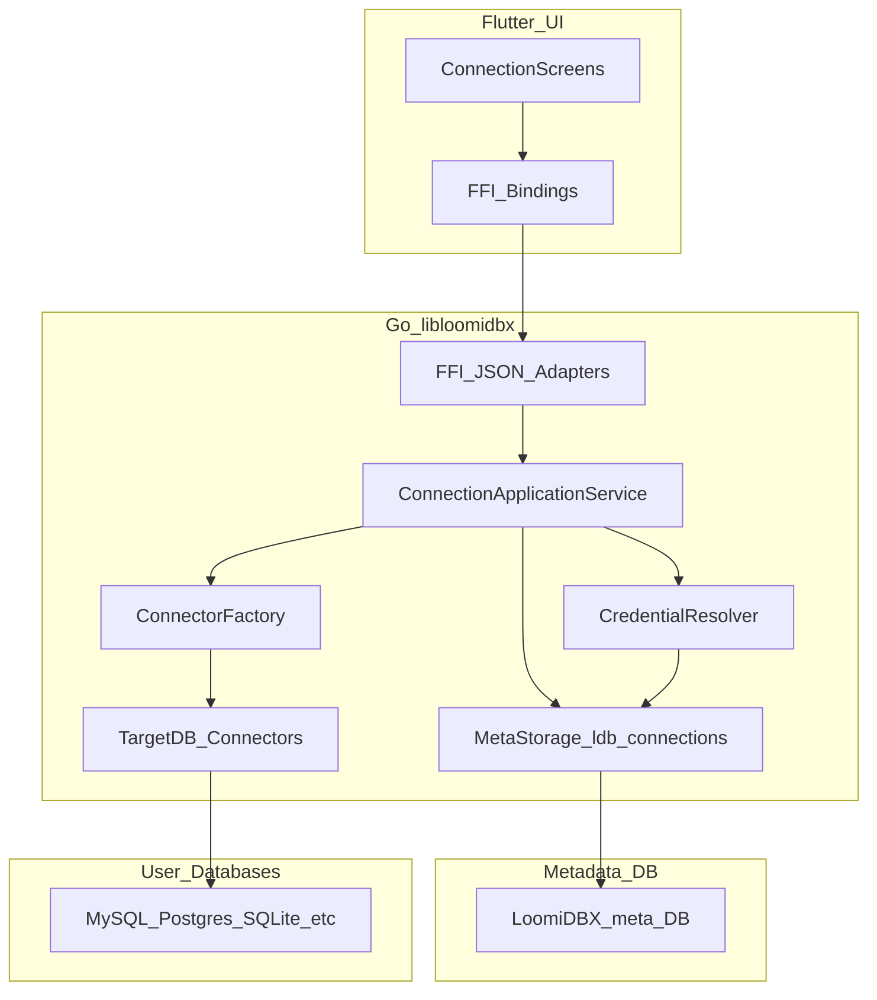
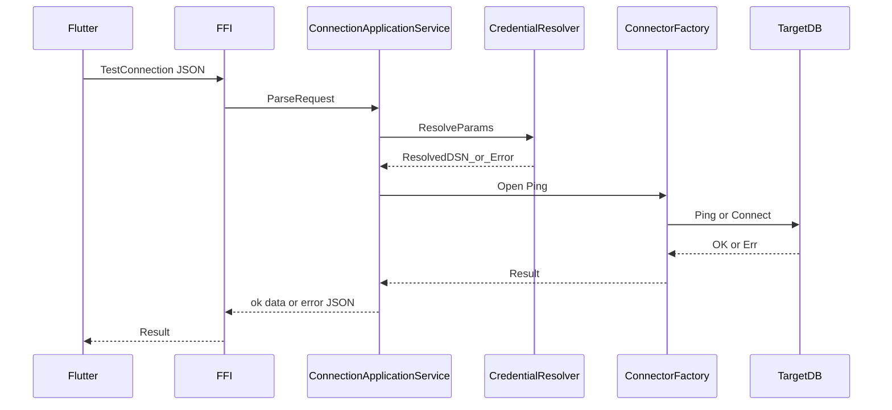

# Design Document: spec-01-connection-and-credentials

## Overview

本子系统在 LoomiDBX 桌面应用中交付「数据库连接的配置生命周期、连接可达性验证、以及凭据的安全存储与注入策略」，使后续 spec-02（Schema 扫描）、spec-06（FFI 契约细化）与 spec-07（完整 UI 主流程）能够依赖稳定的连接基座。

**用户**：数据库管理员与开发者通过 Flutter 客户端管理连接；自动化场景可通过环境变量注入参数。

**影响**：在既有 `StorageDriver` + `ldb_connections` 模型与 steering 规定的 AES-256 列加密语义上，补充凭据来源枚举、环境变量解析规则及密钥环引用约定；不引入 Schema 扫描、生成器与写入引擎。

### Goals

- 提供可测试的连接创建、编辑、删除与「连接测试」流程，并与元数据迁移共存。
- 连接记录在 `ldb_connections` 中持久化，敏感信息不以明文形式出现在日志或错误输出中。
- 定义并实现环境变量与密钥环（在支持的平台）两类增强策略，且行为可文档化、可自动化测试。

### Non-Goals

- 不实现 `ScanSchema`、Diff、生成器配置、批量写入与事务编排（分别属 spec-02～04）。
- 不在本子系统内完成 Flutter 全屏布局与向导体验（spec-07）；本子系统仅保证 FFI/API 语义可被 UI 消费。

## Architecture

### Existing Architecture Analysis

- **现状**：`docs/schema.md` 与 `steering/database-schema.md` 已定义 Flutter ↔ Go FFI、JSON 载荷、`StorageDriver`、以及 `ldb_connections` 表结构（含 AES-256 密码列与 `extra` JSON）。
- **约束**：连接 ID 为下游外键引用点；Migration 顺序与 `ldb_schema_migrations` 绑定。
- **本特性增量**：在 Connector 建连路径上增加「解析后的连接参数」构造；在存储层增加凭据来源与解析元数据，不修改扫描与 Mapper 域表语义。

### Architecture Pattern & Boundary Map

**选定模式**：后端聚合「连接应用服务」+「凭据解析器」+「连接器工厂」，元数据仍经 `StorageDriver`；FFI 层薄封装为 JSON。




**边界**：

- **ConnectionApplicationService**：唯一编排「读配置 → 解析凭据 → 建连或测试 → 返回统一错误模型」的入口，供 FFI 调用。
- **CredentialResolver**：仅负责按策略合并「库内记录、环境变量、密钥环 token」，不参与 SQL 生成与扫描。
- **ConnectorFactory / Drv**：各 `db_type` 的 `database/sql` 打开与 DSN 差异隔离；spec-01 不要求实现扫描方法，但接口预留与 steering 中 `Connector` 长期一致。

**Steering 合规**：`LDB_` 前缀、JSON FFI、`ldb_` 表前缀、`ldb_connections` 列加密要求。

### Technology Stack


| Layer        | Choice / Version                  | Role in Feature                       | Notes                           |
| ------------ | --------------------------------- | ------------------------------------- | ------------------------------- |
| Frontend     | Flutter 3.x, Riverpod             | 连接表单、调用 FFI                           | 耗时调用进 Isolate（steering）         |
| FFI          | CGo buildmode c-shared, JSON      | `TestConnection` / `SaveConnection` 等 | 与 `docs/schema.md` §六 对齐        |
| Backend      | Go 1.26+, database/sql            | 建连、连接池短期使用用于测试                        | Phase1 驱动：MySQL、Postgres、SQLite |
| Meta storage | SQLite 默认或 StorageDriver          | `ldb_connections` 持久化                 | `LOOMIDBX_STORAGE` 切换           |
| Security     | OS keychain 抽象层 + encrypt at rest | 密钥环或 AES 列                            | 实现阶段按 OS 分包                     |


### Minimum Platform Support Matrix（密钥环）


| Platform    | Keyring Backend (Minimum)      | Availability Probe               | If Unavailable                         | If Access Denied                   |
| ----------- | ------------------------------ | -------------------------------- | -------------------------------------- | ---------------------------------- |
| Windows 10+ | Credential Manager / DPAPI 适配层 | 启动时与保存前双重探测 `IsKeyringAvailable` | 返回 `KEYRING_UNAVAILABLE`，允许改为环境变量或拒绝保存 | 返回 `KEYRING_ACCESS_DENIED`，不回退明文存储 |
| macOS 12+   | Keychain Services 适配层          | 启动时与保存前双重探测 `IsKeyringAvailable` | 返回 `KEYRING_UNAVAILABLE`，允许改为环境变量或拒绝保存 | 返回 `KEYRING_ACCESS_DENIED`，不回退明文存储 |
| Linux (XDG) | Secret Service/libsecret 适配层   | 启动时与保存前双重探测 `IsKeyringAvailable` | 返回 `KEYRING_UNAVAILABLE`，允许改为环境变量或拒绝保存 | 返回 `KEYRING_ACCESS_DENIED`，不回退明文存储 |


- 平台不在最小矩阵内时，统一视为 `KEYRING_UNAVAILABLE`。
- 所有失败路径均不得静默写入明文凭据到 `ldb_connections` 或其他非安全存储。

## System Flows

### 连接测试（顺序）




### 保存连接

- 校验字段 → 若策略为密钥环：写入密钥环并仅在 `ldb_connections` 存引用 → 若策略为列加密：走既有 AES-256 路径 → 提交事务 → 返回连接 ID。

## Requirements Traceability


| Requirement | Summary          | Components                    | Interfaces            | Flows  |
| ----------- | ---------------- | ----------------------------- | --------------------- | ------ |
| 1.1         | 持久化连接字段与 ldb 前缀  | Store, Migration              | `SaveConnection`      | 保存流    |
| 1.2         | 稳定连接 ID          | Store                         | `ldb_connections.id`  | 保存流    |
| 1.3         | 删除与凭据清理（警示确认后级联） | AppSvc, Cred, Store           | `DeleteConnection`    | 删除流    |
| 1.4         | 持久化失败错误          | AppSvc, Store                 | FFI error             | 保存流    |
| 2.1         | 连接测试成功路径         | AppSvc, CF                    | `TestConnection`      | 连接测试序列 |
| 2.2         | 测试失败归类           | AppSvc                        | 结构化 error code        | 连接测试序列 |
| 2.3         | 同步测试语义 + 可配置超时   | AppSvc                        | `timeout_sec` + 超时错误码 | 连接测试序列 |
| 3.1–3.3     | 密钥环与安全降级         | Cred, optional KeyringAdapter | `CredentialResolver`  | 解析阶段   |
| 4.1–4.3     | 环境变量优先级与脱敏       | Cred                          | 命名规则文档 + 单测           | 解析阶段   |
| 5.1–5.3     | 范围控制与下游衔接        | 全部边界声明                        | design 与 spec-06 对齐   | N/A    |


## Components and Interfaces

### Summary


| Component                    | Domain       | Intent               | Req Coverage | Key Dependencies                                  | Contracts |
| ---------------------------- | ------------ | -------------------- | ------------ | ------------------------------------------------- | --------- |
| ConnectionApplicationService | Go 后端        | 编排测试与 CRUD           | 1.x, 2.x     | CredentialResolver, MetaStorage, ConnectorFactory | Service   |
| CredentialResolver           | Go 后端        | 环境变量、密钥环、列加密协调       | 3.x, 4.x     | OS adapters, Store                                | Service   |
| MetaStorage                  | Go storage   | `ldb_connections` 访问 | 1.x          | StorageDriver                                     | Service   |
| ConnectorFactory             | Go connector | 按 `db_type` 建连       | 2.x          | database/sql drivers                              | Service   |
| FFI JSON Adapters            | Go ffi       | 请求解析与错误封装            | 5.x          | ConnectionApplicationService                      | API       |


### Backend Layer

#### ConnectionApplicationService


| Field        | Detail                                |
| ------------ | ------------------------------------- |
| Intent       | 对外暴露连接测试、列表、保存、删除的统一用例级 API（供 FFI 调用） |
| Requirements | 1.1–1.4, 2.1–2.3, 5.1–5.3             |


**Responsibilities & Constraints**

- 不调用 `ScanSchema` 与写入器；仅 `Ping`/`Connect` 级别验证。
- 删除连接时必须调用 `CredentialResolver.Purge` 清除密钥环侧残余（若存在）。
- 删除连接采用固定策略：UI 警示用户并确认后，后端执行级联删除（连接及其关联元数据），并在同一事务边界内完成凭据清理与级联落库。

**Dependencies**

- Inbound: FFI JSON Adapters — RPC（P0）
- Outbound: CredentialResolver — 凭据解析（P0）
- Outbound: MetaStorage — CRUD（P0）
- Outbound: ConnectorFactory — 目标库访问（P0）

**Contracts**: Service

##### Service Interface（逻辑签名，非最终实现）

```go
// ConnectionApplicationService 提供给 FFI 的内部契约（示意）
type ConnectionApplicationService interface {
    TestConnection(ctx context.Context, req ConnectionRequest) (*TestConnectionResult, *AppError)
    SaveConnection(ctx context.Context, req SaveConnectionRequest) (*ConnectionRef, *AppError)
    ListConnections(ctx context.Context) ([]ConnectionSummary, *AppError)
    DeleteConnection(ctx context.Context, id string) *AppError
}
```

- Preconditions: `req` 通过字段级校验；`ctx` 带超时（测试）。
- Postconditions: 成功路径不泄漏密码；错误路径带稳定 `code` 供 spec-06 映射。
- Invariants: `id` 使用 UUID 或 steering 既有生成策略。

#### CredentialResolver


| Field        | Detail                           |
| ------------ | -------------------------------- |
| Intent       | 将「存储策略 + 原始记录 + OS 环境」解析为连接器可用参数 |
| Requirements | 3.1–3.3, 4.1–4.3                 |


**Contracts**: Service

**解析优先级（须实现为单测覆盖的固定表）**

1. 若参数声明 `env:VAR_NAME` 形式且环境变量存在 → 使用该值（不打印值）。
2. 否则若记录含密钥环引用 → 从密钥环取密钥。
3. 否则使用列中 AES 解密后的值（与 steering 一致）。
4. 若均不可用 → 返回可分类错误（缺失变量 / 密钥环拒绝 / 解密失败）。

#### MetaStorage


| Field        | Detail                          |
| ------------ | ------------------------------- |
| Intent       | `ldb_connections` 的 typed 访问与事务 |
| Requirements | 1.1–1.4                         |


**Physical Data Model 要点**

- 表结构遵循 `docs/schema.md`；若增加凭据来源字段，优先放入 `extra` JSON 以避免破坏性 DDL；若必须新列，走新 Migration 版本。
- `password` 列继续存放加密密文或空（当完全使用外部密钥环且不缓存时），不得以日志输出。

#### FFI JSON Adapters


| Field        | Detail                                    |
| ------------ | ----------------------------------------- |
| Intent       | 将 JSON 映射到服务类型并返回 `{"ok","data","error"}` |
| Requirements | 5.2–5.3                                   |


**API Contract（与 steering 对齐，字段级细节以 `docs/schema.md` 为准）**


| Method           | Request 要点                                                      | Response                   | Errors                           |
| ---------------- | --------------------------------------------------------------- | -------------------------- | -------------------------------- |
| TestConnection   | `db_type`, host, port, database, username, extra, `timeout_sec` | `{ "status": "ok" }`（同步返回） | 认证失败、超时(`DEADLINE_EXCEEDED`)、TLS |
| SaveConnection   | `name`, 连接四元组, `extra`, 凭据策略, `timeout_sec`                     | `{ "id": "..." }`          | 校验错误、存储错误                        |
| ListConnections  | 无或筛选                                                            | 连接列表（密码永不返回）               | 存储错误                             |
| DeleteConnection | `id`, `confirm_cascade=true`                                    | `{ "status": "ok" }`       | 未找到、`CONFIRMATION_REQUIRED`、存储错误 |


## Data Models

### Logical Data Model

- **Connection 聚合根**：以 `ldb_connections.id` 为标识；`extra` 扩展字段承载 SSL、charset、`credential_mode`（列加密 | 密钥环引用 | 仅环境变量）等。
- **不变量**：删除连接采用“警示用户 -> 用户确认 -> 后端级联删除”固定策略；未携带 `confirm_cascade=true` 时返回 `CONFIRMATION_REQUIRED`，不得执行删除。
- **连接超时配置**：连接配置新增 `timeout_sec`（默认 20，允许用户指定），用于 `TestConnection` 与后续建连超时边界统一。

### Data Contracts & Integration

- JSON 序列化使用项目统一的 `json-iterator` 与 steering 错误包装。
- 与 spec-06：错误对象包含 `code`, `message`, 可选 `details`（无敏感字段）。

## Error Handling

### Error Strategy

- **用户错误**：参数缺失、格式非法 → HTTP 风格可映射为 `INVALID_ARGUMENT` 等价码。
- **外因错误**：网络、TLS、认证失败 → `UPSTREAM_UNAVAILABLE` / `AUTH_FAILED`。
- **超时错误**：同步 `TestConnection` 超时返回 `DEADLINE_EXCEEDED`，并在 `details` 标明生效超时秒数（不含敏感信息）。
- **内部错误**：存储失败、解密失败 → `INTERNAL` 或 `STORAGE_ERROR`。

### Monitoring

- 结构化日志：记录 `connection_id`、操作类型、`db_type`、耗时；**不**记录密码、令牌、环境变量解析后的值。

## Testing Strategy

- **单元测试**：`CredentialResolver` 优先级与脱敏；连接 URL 拼装（MySQL/Postgres/SQLite）；错误码映射表。
- **集成测试**：嵌入式 SQLite 元数据 + 本机或 testcontainer 目标库进行 `TestConnection`；Migration 升级路径。
- **契约测试**：JSON FFI 请求响应与 `docs/schema.md` 样例一致；为未来 spec-06 提供 golden file。
- **跨 spec 衔接**：Mock 连接器验证「仅连接、不扫描」假设；对 `spec-02` 暴露的「需要有效 `sql.DB`」接口在假验层声明 TODO 钩子。

## Security Considerations

- 默认与 steering 一致：**列加密 + 禁止明文日志**；密钥环为增强项而非弱化审计。
- 环境变量方案必须文档化「冲突优先级」，避免运维与本地保存互相覆盖产生非确定性。

## Performance & Scalability

- 连接测试采用同步接口，默认超时 20s；允许用户在连接配置中覆盖 `timeout_sec`，避免阻塞 UI Isolate。
- 不建议在 spec-01 长期缓存目标库连接池至全局；以「测试时短连接」为主，完整池化留给后续高频写入 spec。

## Supporting References

- 权威 DDL 与 FFI 清单：`[docs/schema.md](../../../docs/schema.md)`
- steering 摘要：`[.kiro/steering/database-schema.md](../../steering/database-schema.md)`
- 调研笔记：`[research.md](./research.md)`

