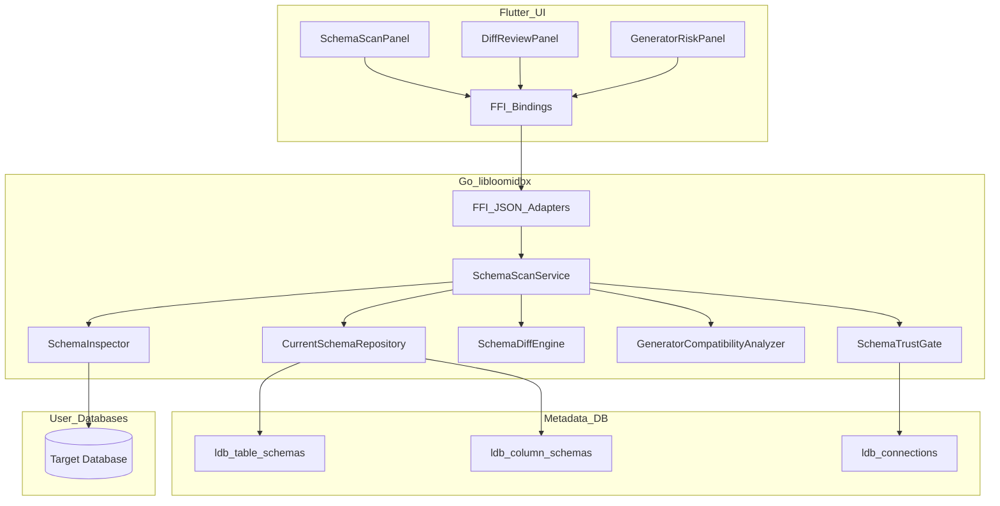
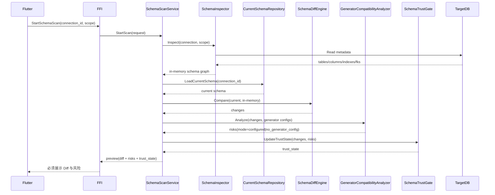
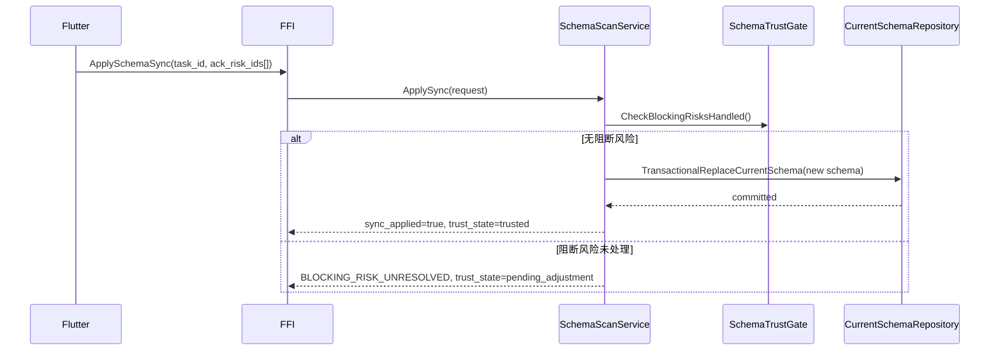

# Design Document: spec-02-schema-scan-and-diff

## Overview

本设计实现“Schema 扫描、Diff 与同步”能力：扫描阶段仅在内存中构建临时 schema 快照，与当前持久化 schema 对比；Diff 结果必须经 UI 呈现。若无阻断级兼容性风险，可直接落库覆盖当前 schema；若有阻断风险，必须先调整生成器配置后才允许落库与后续执行。

**用户**：数据库管理员、数据工程师、配置生成器规则的业务用户。  
**影响**：强化扫描运行时任务上下文管理、Diff、兼容性分析与可信度状态管理；不新增扫描任务持久化表、快照表、审计表。

### Goals

- 支持全库/单表扫描并形成稳定内存 schema 结构。
- 保持“当前 schema 单一真相”持久化策略，不保留历史快照。
- 提供明确状态机：`trusted`、`pending_rescan`、`pending_adjustment`。

### Non-Goals

- 不实现字段生成规则执行（spec-03）。
- 不实现执行编排与写入事务（spec-04）。
- 不做历史 schema 回溯与快照审计追溯。

## Architecture

### Existing Architecture Analysis

- 上游 spec-01 已提供连接与凭据模型。
- steering 已定义核心 schema 表（`ldb_table_schemas`、`ldb_column_schemas`）与 FFI JSON 边界。
- 本设计在不引入新快照/审计表前提下，增强内存 Diff 与同步闸门语义。

### Architecture Pattern & Boundary Map

**选定模式**：应用服务编排 + 扫描适配器 + 当前 schema 仓储 + Diff/兼容性引擎 + 信任状态闸门。

**边界约束**：

- `SchemaScanService`：编排扫描、Diff、风险评估、同步决策；不执行数据生成。
- `SchemaInspector`：只负责目标库结构读取与标准化。
- `CurrentSchemaRepository`：只维护当前 schema（`ldb_table_schemas`/`ldb_column_schemas`）。
- `SchemaTrustGate`：维护状态机并对阻断风险进行准入控制。

## System Flows

### 扫描、Diff 与 UI 呈现

### 同步当前 schema（自动/手动）

## Requirements Traceability

| Requirement | Summary | Components | Interfaces | Flows |
| ----------- | ------- | ---------- | ---------- | ----- |
| 1.x | 扫描运行时任务上下文与状态 | SchemaScanService, SchemaInspector | `StartSchemaScan`, `GetSchemaScanStatus` | 扫描、Diff 与 UI 呈现 |
| 2.x | 当前 schema 持久化 | CurrentSchemaRepository | `ApplySchemaSync`, `GetCurrentSchema` | 同步当前 schema |
| 3.x | 内存 Diff 分类 | SchemaDiffEngine | `PreviewSchemaDiff` | 扫描、Diff 与 UI 呈现 |
| 4.x | 兼容性风险与确认 | GeneratorCompatibilityAnalyzer, SchemaTrustGate | `GetGeneratorCompatibilityRisks`, `ApplySchemaSync` | 扫描、Diff 与 UI 呈现 |
| 5.x | 重扫与范围控制 | SchemaScanService, SchemaTrustGate | `StartSchemaRescan`, `GetSchemaTrustState` | 扫描、Diff 与 UI 呈现 |

## Components and Interfaces

### Summary

| Component | Domain | Intent | Req Coverage | Key Dependencies | Contracts |
| --------- | ------ | ------ | ------------ | ---------------- | --------- |
| SchemaScanService | Go 应用层 | 编排扫描、Diff、风险分析与同步 | 1.x, 2.x, 4.x, 5.x | CurrentSchemaRepository, SchemaDiffEngine, GeneratorCompatibilityAnalyzer, SchemaTrustGate | Service |
| SchemaInspector | Go 数据访问层 | 读取目标库结构并标准化 | 1.x, 5.x | ConnectorFactory(spec-01), DB metadata APIs | Service |
| CurrentSchemaRepository | Go 存储层 | 覆盖更新当前 schema | 2.x | StorageDriver | Repository |
| SchemaDiffEngine | Go 领域层 | 对比内存扫描结果与当前 schema | 3.x | CurrentSchemaRepository | Domain Service |
| GeneratorCompatibilityAnalyzer | Go 领域层 | 判定 Diff 对生成器配置的兼容性风险 | 4.x | Generator config store(spec-03), SchemaDiffEngine | Domain Service |
| SchemaTrustGate | Go 领域层 | 维护 `trusted/pending_rescan/pending_adjustment` 状态 | 5.x | SchemaDiffEngine, GeneratorCompatibilityAnalyzer | Domain Service |
| FFI JSON Adapters | Go FFI 层 | 暴露统一 JSON 契约与错误模型 | 1.x-5.x | SchemaScanService | API |

### API Contract（逻辑签名，非最终实现）

| Method | Request 要点 | Response | Errors |
| ------ | ------------ | -------- | ------ |
| `StartSchemaScan` | `connection_id`, `scope(all|table)`, `table_names[]`, `trigger` | `task_id`, `status` | 连接错误、权限错误、方言不支持 |
| `GetSchemaScanStatus` | `task_id` | `status`, `progress`, `preview_ready`, `trust_state`, `error?` | 任务不存在 |
| `PreviewSchemaDiff` | `task_id` | `summary`, `changes[]`, `risk_summary`, `trust_state` | 任务未完成、对比失败 |
| `GetGeneratorCompatibilityRisks` | `task_id` | `mode(configured|no_generator_config)`, `risks[]` | 分析失败（`no_generator_config` 非错误） |
| `ApplySchemaSync` | `task_id`, `ack_risk_ids[]` | `sync_applied`, `schema_updated_at`, `trust_state` | `BLOCKING_RISK_UNRESOLVED`, `FAILED_PRECONDITION` |
| `StartSchemaRescan` | `connection_id`, `strategy(full|impacted)`, `reason` | `task_id`, `status` | 参数错误、连接错误 |
| `GetCurrentSchema` | `connection_id`, `scope` | `schema`, `trust_state` | 当前 schema 不存在 |
| `GetSchemaTrustState` | `connection_id` | `trust_state`, `reason` | 连接不存在 |

## Data Models

### Logical Data Model

- `ldb_table_schemas` / `ldb_column_schemas`：作为当前 schema 唯一持久化来源，按连接维度覆盖更新。
- `ldb_connections.extra`（或等价字段）：保存 `schema_trust_state` 与最近阻断原因。
- 扫描任务上下文：`task_id`、`status`、`progress` 与 `preview` 仅在运行时上下文维护，不落库为独立扫描历史表。

### Trust State

- `trusted`：当前 schema 与生成器配置兼容，可继续执行。
- `pending_rescan`：连接或环境变化后需重新扫描。
- `pending_adjustment`：存在阻断风险，需用户调整生成器后再同步。

### Trust State Transition Rules

| Current | Trigger | Next | Notes |
| ------- | ------- | ---- | ----- |
| `trusted` | 连接配置变更（驱动、DSN、凭据、目标库） | `pending_rescan` | 旧 schema 可信度失效，需先重扫。 |
| `trusted` | 扫描 Diff 识别到阻断级风险 | `pending_adjustment` | 必须先处理风险，再允许同步。 |
| `pending_rescan` | 重扫完成且无阻断风险，并同步成功 | `trusted` | 恢复可信并允许下游执行。 |
| `pending_rescan` | 重扫完成但存在阻断风险 | `pending_adjustment` | 进入调整态，等待用户处理。 |
| `pending_adjustment` | 风险已处理且同步成功 | `trusted` | 解除阻断，恢复执行。 |
| `pending_adjustment` | 再次发生连接配置变更 | `pending_rescan` | 连接变化优先要求重扫。 |

状态机约束：

- 仅 `trusted` 可放行后续生成执行流程。
- `pending_rescan` / `pending_adjustment` 必须通过稳定错误码向 FFI/UI 暴露阻断原因。

## Error Handling

### Error Strategy

- 参数与状态错误：`INVALID_ARGUMENT`、`FAILED_PRECONDITION`。
- 上游连接错误：`UPSTREAM_UNAVAILABLE`、`AUTH_FAILED`、`PERMISSION_DENIED`。
- 对比与同步错误：`CURRENT_SCHEMA_NOT_FOUND`、`DIFF_SCOPE_MISMATCH`、`BLOCKING_RISK_UNRESOLVED`。
- 存储错误：`STORAGE_ERROR`。
- 无生成器配置：返回 `mode=no_generator_config` 与空 `risks`，不视作错误。

### Monitoring

- 记录扫描耗时、变更统计（新增/删除/修改）、阻断风险数量、状态迁移。
- 日志只记录连接 ID 与任务 ID，不输出凭据或敏感参数。

## Testing Strategy

- 单元测试：Schema 标准化、Diff 分类、兼容性分析、`trust_state` 状态机。
- 集成测试：扫描 -> Diff/UI 预览 -> 自动/手动同步当前 schema 全链路。
- 契约测试：FFI JSON 形状、错误码、阻断闸门行为。
- 跨 spec 联调：与 spec-03 验证风险闸门；与 spec-04 验证阻断传播；与 spec-05/spec-07 验证 Diff 展示契约。

## Supporting References

- 规划来源：`[SPECS_PLANNING.md](../../../SPECS_PLANNING.md)`
- 上游依赖：`[spec-01-connection-and-credentials](../spec-01-connection-and-credentials/spec.json)`

