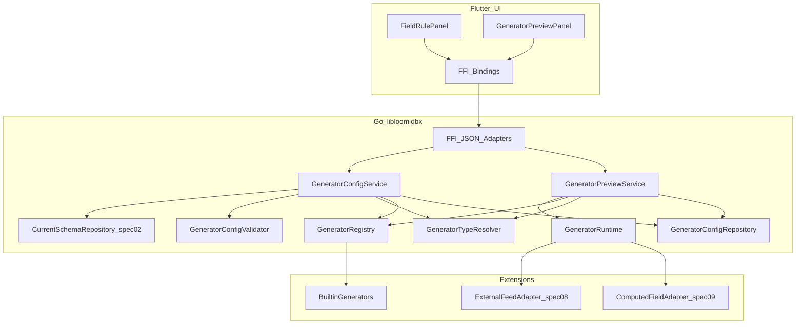
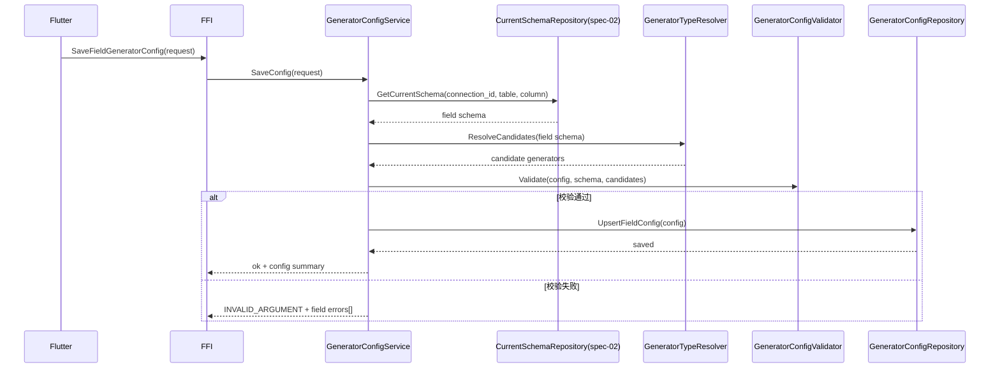
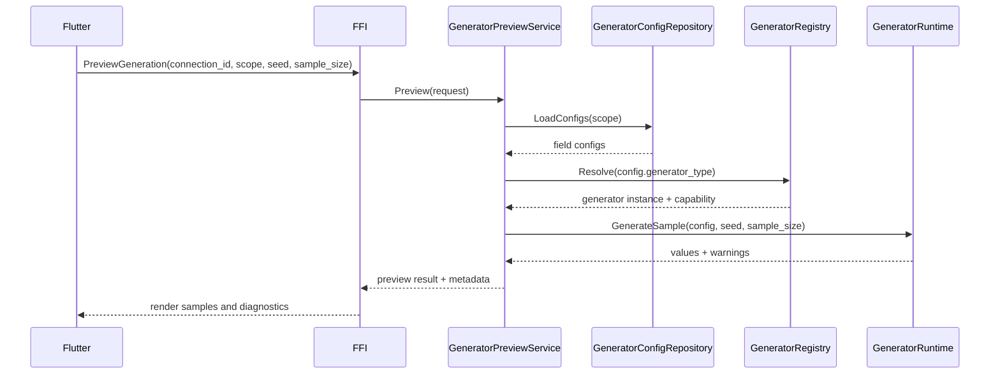
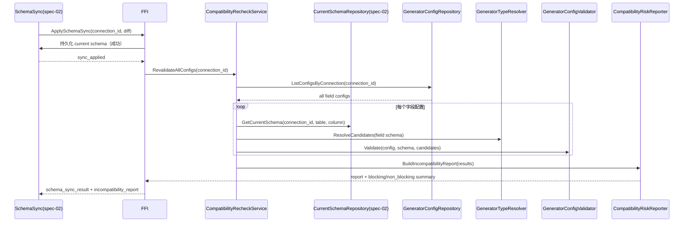

# Design Document: spec-03-generator-framework

## Overview

本设计实现“生成器框架与字段规则”能力：基于 `spec-02` 同步后的可信 schema，构建可扩展的 Generator 接口、注册机制、字段配置模型与预览 API。该能力仅覆盖单字段/单表值生成，不负责编排跨表依赖与批量写入事务。

**用户**：配置数据生成规则的业务用户、平台开发者、FFI/UI 调用方。  
**影响**：新增生成器注册中心、类型映射与配置校验能力；向下游执行层输出统一可消费的生成上下文与错误模型。

### Goals

- 提供统一 Generator 抽象与插件化注册能力。
- 支持字段级规则配置、校验与快速预览。
- 保证确定性场景可复现，并维持安全边界与契约稳定。
- 支持 ENUM/集合值场景：以通用枚举值生成器承载候选值集合，并按字段类型执行类型一致性约束。

### Non-Goals

- 不实现跨表依赖拓扑排序（由 `spec-04` 负责）。
- 不实现批量写入、事务提交与回滚机制（由 `spec-04` 负责）。
- 不实现完整 LLM 供给编排（由 `spec-11` 在后续扩展）。

## Architecture

### Existing Architecture Analysis

- `spec-02` 已提供当前 schema 与兼容性闸门基础，可作为字段配置校验输入。
- 当前代码中已存在 schema 与 FFI 基础模块，可复用错误码与 JSON 响应包装。
- 本 spec 重点补齐“生成规则定义与预览”层，避免执行职责泄漏。

### Architecture Pattern & Boundary Map

**选定模式**：领域服务 + 注册中心 + 配置仓储 + 预览应用服务。




**边界约束**：

- `GeneratorRegistry`：负责注册、发现与能力声明，不执行具体编排。
- `GeneratorConfigService`：负责字段规则读写与校验，不产出最终写库动作。
- `GeneratorPreviewService`：仅生成样本与诊断信息，不调用执行写入引擎。
- `GeneratorRuntime`：按单字段/单表上下文执行生成器，不负责跨表排序。

# System Flows

### 字段规则配置与校验流程




### 预览生成流程（单字段/单表）




### Schema 同步后立即全量重判定流程（A 方案）



约束：

- 触发时机固定为 `ApplySchemaSync` 成功后立即执行，不允许仅依赖惰性读取触发。
- 重判定范围为该 `connection_id` 下全部字段配置，结果按字段聚合返回。
- 出现不兼容时必须返回字段定位信息（`connection_id + table + column`）与建议动作，不得静默跳过。
- 对阻断级风险，需与 `spec-02` 的可信度状态联动，进入 `pending_adjustment` 并阻断后续执行链路。

## Requirements Traceability


| Requirement | Summary     | Components                                                                  | Interfaces                                            | Flows      |
| ----------- | ----------- | --------------------------------------------------------------------------- | ----------------------------------------------------- | ---------- |
| 1.x         | 统一接口与注册     | GeneratorRegistry, GeneratorRuntime                                         | `RegisterGenerator`, `ListGeneratorCapabilities`      | 配置与校验、预览生成 |
| 2.x         | 类型映射与候选选择   | GeneratorTypeResolver, GeneratorRegistry, CompatibilityRecheckService       | `GetFieldGeneratorCandidates`, `RevalidateAllConfigs` | 配置与校验、Schema 同步后重判定 |
| 3.x         | 字段配置与校验     | GeneratorConfigService, GeneratorConfigValidator, GeneratorConfigRepository | `SaveFieldGeneratorConfig`, `GetFieldGeneratorConfig` | 配置与校验      |
| 4.x         | 预览与可复现性     | GeneratorPreviewService, GeneratorRuntime                                   | `PreviewGeneration`                                   | 预览生成       |
| 5.x         | 边界、安全、契约一致性 | FFI JSON Adapters, GeneratorPreviewService                                  | `PreviewGeneration`, `SaveFieldGeneratorConfig`       | 全流程        |


## Components and Interfaces

### Summary


| Component                   | Domain   | Intent                      | Req Coverage       | Key Dependencies                    | Contracts      |
| --------------------------- | -------- | --------------------------- | ------------------ | ----------------------------------- | -------------- |
| GeneratorRegistry           | Go 领域层   | 管理生成器注册、能力查询与冲突检测           | 1.x, 2.x           | BuiltinGenerators, extensions       | Domain Service |
| GeneratorTypeResolver       | Go 领域层   | 根据字段 schema 解析候选生成器         | 2.x, 3.x           | Current schema (spec-02), Registry  | Domain Service |
| CompatibilityRecheckService | Go 应用层   | 在 schema 同步成功后立即全量重判定字段配置兼容性 | 2.x, 3.x, 5.x      | Current schema, Validator, ConfigRepository | Service        |
| GeneratorConfigValidator    | Go 领域层   | 校验字段级配置合法性                  | 3.x                | TypeResolver, schema metadata       | Domain Service |
| GeneratorConfigService      | Go 应用层   | 编排配置读写与错误映射                 | 1.x, 2.x, 3.x, 5.x | Validator, ConfigRepository         | Service        |
| GeneratorPreviewService     | Go 应用层   | 生成样本、汇总预览元数据                | 4.x, 5.x           | Runtime, Registry, ConfigRepository | Service        |
| GeneratorRuntime            | Go 运行时层  | 执行单字段生成调用                   | 1.x, 4.x, 5.x      | Generator plugins, adapters         | Runtime        |
| EnumValueGenerator（Builtin） | Go 生成器层  | 基于候选值集合输出枚举值，支持数值/字符串等类型化输出 | 2.x, 3.x, 4.x      | Runtime, Validator                  | Generator      |
| FFI JSON Adapters           | Go FFI 层 | 输出稳定 JSON 契约与脱敏错误           | 3.x, 4.x, 5.x      | ConfigService, PreviewService       | API            |


### API Contract（逻辑签名，非最终实现）


| Method                         | Request 要点                                                                                                    | Response                                                   | Errors                                    |
| ------------------------------ | ------------------------------------------------------------------------------------------------------------- | ---------------------------------------------------------- | ----------------------------------------- |
| `RegisterGenerator`            | `generator_type`, `type_tags[]`, `capability`                                                                | `registered`                                               | `INVALID_ARGUMENT`, `GENERATOR_CONFLICT`  |
| `ListGeneratorCapabilities`    | `field_type?`                                                                                                 | `generators[]`                                             | `INVALID_ARGUMENT`                        |
| `GetFieldGeneratorCandidates`  | `connection_id`, `table`, `column`                                                                            | `candidates[]`, `default_generator`                        | `CURRENT_SCHEMA_NOT_FOUND`                |
| `SaveFieldGeneratorConfig`     | `connection_id`, `table`, `column`, `generator_type`, `generator_opts(params)`, `seed_policy`, `null_policy`, `is_enabled`, `modified_source` | `saved`, `config_version`, `is_enabled`, `modified_source`, `warnings[]` | `INVALID_ARGUMENT`, `FAILED_PRECONDITION` |
| `GetFieldGeneratorConfig`      | `connection_id`, `table`, `column`                                                                            | `config`                                                   | `NOT_FOUND`                               |
| `PreviewGeneration`            | `connection_id`, `scope(field|table)`, `seed?`, `sample_size`                                                | `samples[]`, `metadata`, `warnings[]`                     | `INVALID_ARGUMENT`, `FAILED_PRECONDITION` |
| `ValidateFieldGeneratorConfig` | `connection_id`, `draft_config`                                                                               | `valid`, `errors[]`                                        | `INVALID_ARGUMENT`                        |


### Generator Interface（与 steering 对齐）

为避免实现漂移，`spec-03` 显式采用 `steering/generator.md` 约束的统一接口：

```go
type Generator interface {
    // Generate: 基于单次上下文生成一个值；用于单值预览或运行时逐条调用。
    Generate(ctx GenerateContext) (GeneratedValue, error)
    // GenerateBatch: 基于同一上下文批量生成 count 个值；用于预览批量样本。
    GenerateBatch(ctx GenerateContext, count int) ([]GeneratedValue, error)
    // Reset: 重置内部状态（如序列游标、缓存随机源）；用于新会话或重试前清理。
    Reset() error
    // Type: 返回生成器逻辑类型标识（强类型枚举）。
    Type() GeneratorType
}
```

说明：为与 `steering/tech.md` 对齐，领域接口统一使用 `GeneratorType`；FFI JSON 契约层序列化为稳定字符串值（如 `sequence`、`enum`）。

术语对齐：`generator_type` 即 `GeneratorType` 的稳定字符串序列化值；在配置、预览与能力查询契约中统一使用该字符串。

注册语义：`RegisterGenerator` 为进程启动期/模块初始化阶段的内部注册抽象（编译时集成），不提供运行时热插拔动态注册能力。

`GeneratorRuntime` 调用约束：

- `PreviewGeneration(sample_size=1)`：优先调用 `Generate(ctx)`；如生成器仅优化批量路径，可等价路由到 `GenerateBatch(ctx, 1)`。
- `PreviewGeneration(sample_size>1)`：调用 `GenerateBatch(ctx, count)`，并保证返回顺序与请求上下文一致。
- 每次预览请求进入前，Runtime 必须按 seed 策略初始化上下文随机源；同一请求内禁止重复 `Reset()` 导致序列非预期回退。
- Runtime 仅负责调用与错误归一化，不承载跨表调度与写入行为（边界仍归 `spec-04`）。

### 类型映射规则补充（MVP）

- 数据库原生 `ENUM/SET`（或等价集合类型）映射为“集合约束字段”，候选生成器集合中必须包含 `EnumValueGenerator`。
- `EnumValueGenerator` 作为通用生成器，不绑定单一抽象类型；其 `params.values[]` 的元素类型必须与字段抽象类型兼容。
- 兼容性规则示例：
  - `int` 字段可使用 `[1,2,3]`；
  - `string` 字段可使用 `["x","y","z"]`；
  - `decimal/datetime/boolean` 字段同理按目标抽象类型校验。
- 当 `params.values[]` 出现混合类型或与字段类型不兼容时，校验阶段返回字段级 `INVALID_ARGUMENT`，并给出错误路径（如 `params.values[2]`）。

## Data Models

### Logical Data Model

- `registered_generators`（逻辑运行时模型）：进程内已注册生成器清单（`generator_type`、能力声明、参数 schema），用于能力查询，不做数据库持久化。
- `field_generator_configs`（逻辑模型）：连接/表/字段维度配置，包含 `generator_type`、参数 JSON、空值策略、种子策略、启用状态（`is_enabled`）、配置版本号、更新时间、修改来源与可选修改人。
- `generation_preview_sessions`（运行时模型）：预览请求上下文、样本结果、警告信息，仅运行时使用，不作为执行历史主数据源。

字段定位语义：FFI/API 入参可使用 `connection_id + table + column` 便于调用侧定位；仓储层在写入 `ldb_column_gen_configs` 前必须先解析为唯一 `column_schema_id`，并以其作为持久化唯一键。

`field_generator_configs` 审计字段约束（固定枚举）：

- `modified_source`（必填，固定枚举）：
  - `ui_manual`：用户在 UI 手工修改；
  - `automap`：来自扫描后的自动映射建议/应用；
  - `schema_sync_migration`：schema 同步过程中的迁移调整；
  - `import_restore`：来自导入配置或恢复操作；
  - `system_patch`：系统级修复任务写入。
- `modified_by`（可选）：操作者标识（本地单机可为空）。
- `is_enabled`（必填，布尔）：字段规则是否启用；`false` 时该字段在预览与执行准备阶段跳过生成器调用，并在响应 `warnings[]` 中返回 `GENERATOR_DISABLED` 提示。

### Physical DDL Alignment（MVP 持久化草案）

说明：本节用于把逻辑模型映射到 steering 已存在表；完整方言细节最终以 `docs/schema.md` 与 migration 为准。

#### 1) 生成器注册信息（不落库）

`GeneratorRegistry` 采用编译时注册（代码内注册表）。

关键约束：

- 注册冲突检测在进程内完成：同一 `generator_type` 重复注册时返回 `GENERATOR_CONFLICT`。
- 能力查询 (`ListGeneratorCapabilities`) 直接读取已注册生成器清单，可按 `field_type` 过滤。

#### 2) `field_generator_configs` -> 对齐 `ldb_column_gen_configs`

`field_generator_configs` 在实现中不新增同名实体，直接对齐并落在 `ldb_column_gen_configs`，保证与 `docs/schema.md` 一致。

```sql
-- 仅列出 spec-03 新增字段；既有字段（如 column_schema_id/generator_type/generator_opts/is_enabled）沿用 docs/schema.md
ALTER TABLE ldb_column_gen_configs ADD COLUMN null_policy VARCHAR(32) NOT NULL DEFAULT 'respect_nullable';
ALTER TABLE ldb_column_gen_configs ADD COLUMN seed_policy TEXT NULL; -- JSON serialized
ALTER TABLE ldb_column_gen_configs ADD COLUMN config_version BIGINT NOT NULL DEFAULT 1;
ALTER TABLE ldb_column_gen_configs ADD COLUMN modified_source VARCHAR(32) NOT NULL DEFAULT 'ui_manual';
ALTER TABLE ldb_column_gen_configs ADD COLUMN modified_by VARCHAR(128) NULL;
ALTER TABLE ldb_column_gen_configs ADD COLUMN updated_at BIGINT NOT NULL;
```

关键约束：

- 唯一键：`UNIQUE(column_schema_id)`（与 `docs/schema.md` 对齐）。
- `modified_source` 固定枚举：`ui_manual | automap | schema_sync_migration | import_restore | system_patch`。
- `null_policy` 建议固定枚举：`respect_nullable | force_non_null | force_null_ratio`。
- `is_enabled` 默认 `TRUE`；当为 `FALSE` 时，不参与运行时生成调用。
- `seed_policy` 为 JSON 对象（结构见“Seed Strategy”章节），用于表达 global/field/preview 的优先级与覆盖信息。

#### 3) 运行时模型 `generation_preview_sessions`

不新增持久化主表；作为运行时对象返回给 `PreviewGeneration`，必要审计由下游执行历史体系承接，避免与 `ldb_generation_runs*` 重叠。

### Seed Strategy（可复现机制）

为满足 Requirement 4.2“同一配置与输入上下文可复现”，统一定义 `seed_policy` 语义。

#### `seed_policy` 结构（字段配置层）

```json
{
  "mode": "inherit_global | fixed | derive_from_row",
  "seed": 123456,
  "derive_key": "connection.table.column"
}
```

- `inherit_global`：字段使用请求/会话全局 seed。
- `fixed`：字段始终使用自身 `seed`，不随全局 seed 变化。
- `derive_from_row`：基于 `derive_key + row_index (+ global_seed)` 计算稳定子种子，用于批量时“每行稳定且可复现”。

#### 优先级与覆盖规则

1. 预览请求显式 `seed`（最高优先级，仅本次请求生效）。
2. 字段 `seed_policy.mode=fixed` 且提供 `seed`。
3. 全局 seed（来自运行会话/任务上下文；与 `steering/generator.md` “MVP 支持全局 seed”对齐）。
4. 无 seed：允许非确定性输出，但响应元数据必须标记 `deterministic=false`。

#### Runtime 传递规则

- `GeneratorPreviewService` 在构造 `GenerateContext` 时注入 `effective_seed`、`seed_source`（preview_override/field_fixed/global/default）。
- `GenerateBatch(ctx, count)` 必须使用同一 `effective_seed` 作为批次根种子；行级随机序列通过 `row_index` 派生，确保“同 seed + 同配置 + 同输入上下文”结果一致。
- 当 `sample_size` 变化时，前 `min(n1,n2)` 条样本在相同上下文下应保持前缀一致（避免批次大小改变导致首样本漂移）。

### Capability Model

- `supports_types[]`：支持的逻辑字段类型。
- `deterministic_mode`：是否支持固定种子复现。
- `requires_external_feed`：是否依赖外部 feed（`spec-08`）。
- `requires_computed_context`：是否依赖计算字段上下文（`spec-09`）。
- `accepts_enum_values`：是否支持“候选值集合”输入（用于 `EnumValueGenerator` 及兼容实现）。

## Error Handling

### Error Strategy

- 配置参数错误：`INVALID_ARGUMENT`。
- schema 缺失或失效：`CURRENT_SCHEMA_NOT_FOUND`、`FAILED_PRECONDITION`。
- 生成器不可用：`UNSUPPORTED_GENERATOR`、`GENERATOR_NOT_REGISTERED`。
- 生成器注册冲突：`GENERATOR_CONFLICT`（同一 `generator_type` 重复注册时拒绝覆盖）。
- schema 同步后重判定发现不兼容：`FAILED_PRECONDITION`（返回字段级不兼容报告与修复建议）。
- 枚举值类型不兼容或混合类型：`INVALID_ARGUMENT`（字段级错误路径定位到 `params.values[*]`）。
- 扩展依赖未就绪：`FAILED_PRECONDITION`（明确上游 spec 提示）。
- 边界外调用：`OUT_OF_SCOPE_EXECUTION_REQUEST`（提示交由 `spec-04`）。

### Monitoring

- 指标：配置校验通过率、预览请求耗时、生成器命中率、错误码分布。
- 日志脱敏：仅记录连接 ID、表字段标识、生成器类型、请求 ID，不记录凭据或明文敏感参数。

## Testing Strategy

- 单元测试：注册冲突检测、类型候选解析、配置校验、固定种子复现。
- 集成测试：字段配置保存 -> 预览调用 -> 错误映射全链路。
- 契约测试：FFI JSON 响应结构与错误码稳定性。
- 跨 spec 联调：与 `spec-02` 验证 `ApplySchemaSync` 成功后立即触发 `RevalidateAllConfigs` 并输出不兼容报告；与 `spec-04` 验证边界错误传播；与 `spec-08/spec-09` 验证扩展点兼容。

## Supporting References

- 规划来源：`[SPECS_PLANNING.md](../../../SPECS_PLANNING.md)`
- 上游依赖：`[spec-02-schema-scan-and-diff](../spec-02-schema-scan-and-diff/spec.json)`

