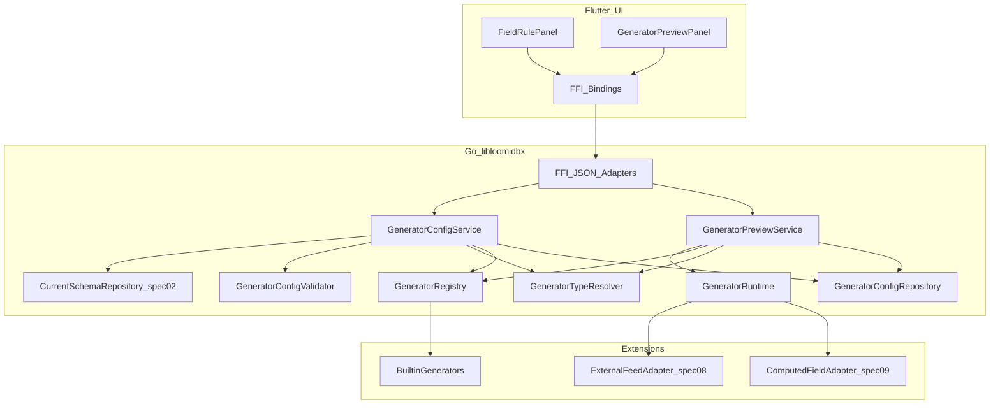
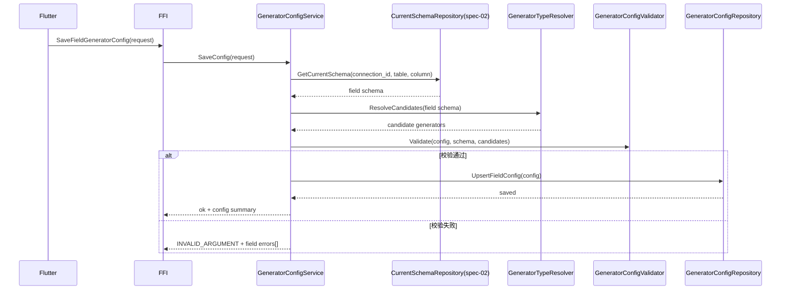
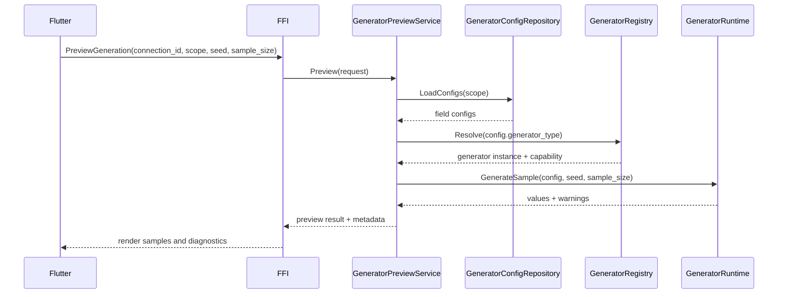
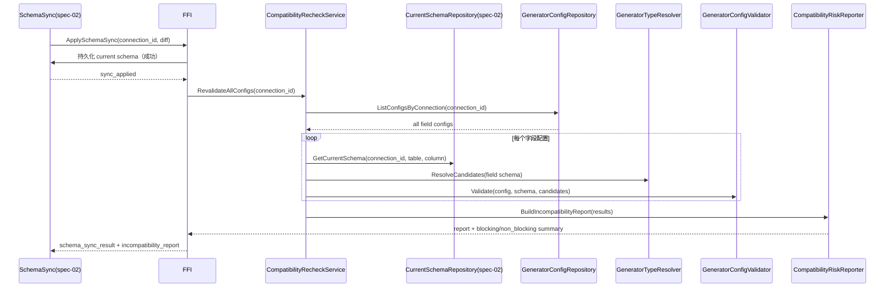

# Design Document: spec-03-generator-framework

## Overview

本设计实现“生成器框架与字段规则”能力：基于 `spec-02` 同步后的可信 schema，构建可扩展的 Generator 接口、注册机制、字段配置模型与预览 API。该能力仅覆盖单字段/单表值生成，不负责编排跨表依赖与批量写入事务。

**用户**：配置数据生成规则的业务用户、平台开发者、FFI/UI 调用方。  
**影响**：新增生成器注册中心、类型映射与配置校验能力；向下游执行层输出统一可消费的生成上下文与错误模型。

### 核心概念：生成器、配置与注册（必须先读）

- **生成器（Generator）**：一段满足 `Generator` 接口的代码，负责为**单个或一批**字段生成模拟数据（例如整数序列、随机字符串、UUID）。生成器**不是**业务库里的「实体」或需单独落库的系统表；其实现随二进制/模块发布，遵循 `steering/generator.md`「编译时集成、非运行时动态插件」。
- **生成器配置（用户侧参数）**：调用某个生成器时传入的参数对象，用于约束行为。例如「整数序列生成器」的参数可以是 `{"start": 1, "step": 1}`。系统在**字段维度**持久化的是「选择了哪种生成器 + 该组参数」，而不是「把生成器本身做成一行数据模型」。
- **注册（Register）**：在**进程内**统一登记内置生成器实现及其元数据（ID、能力、参数 schema 等），供 `GeneratorTypeResolver`/`ListGeneratorCapabilities`/`GetFieldGeneratorCandidates` 查询，例如「某抽象类型的字段当前可选用哪些生成器」。Registry 解决的是**发现与路由**，不是把生成器定义当作持久化业务数据。
- **持久化边界**：需要持久化的是 **`ldb_column_gen_configs`（及同类字段规则表）中的用户配置**——例如 `generator_type` = `IntSequenceGenerator`，`generator_opts` 存储参数序列化后的**字符串**（如上述 JSON 文本）；**不**引入「生成器定义表」把代码级生成器再存一份。

### Goals

- 提供统一 Generator 抽象与**进程内**注册与发现能力（内置实现登记，非 DB 镜像生成器定义）。
- 支持字段级规则配置、校验与快速预览。
- 保证确定性场景可复现，并维持安全边界与契约稳定。
- 支持 ENUM/集合值场景：以通用枚举值生成器承载候选值集合，并按字段类型执行类型一致性约束。

### Non-Goals

- 不实现跨表依赖拓扑排序（由 `spec-04` 负责）。
- 不实现批量写入、事务提交与回滚机制（由 `spec-04` 负责）。
- 不实现完整 LLM 供给编排（由 `spec-11` 在后续扩展）。

## Architecture

### Existing Architecture Analysis

- `spec-02` 已提供当前 schema 与兼容性闸门基础，可作为字段配置校验输入。
- 当前代码中已存在 schema 与 FFI 基础模块，可复用错误码与 JSON 响应包装。
- 本 spec 重点补齐“生成规则定义与预览”层，避免执行职责泄漏。

### Architecture Pattern & Boundary Map

**选定模式**：领域服务 + 注册中心 + 配置仓储 + 预览应用服务。




**边界约束**：

- `GeneratorRegistry`：在进程生命周期内负责**内置生成器实现**的注册、发现与能力声明（含冲突检测），不持久化「生成器目录」为业务数据；不执行跨字段编排。
- `GeneratorConfigService`：负责字段规则读写与校验，不产出最终写库动作。
- `GeneratorPreviewService`：仅生成样本与诊断信息，不调用执行写入引擎。
- `GeneratorRuntime`：按单字段/单表上下文执行生成器，不负责跨表排序。

# System Flows

### 字段规则配置与校验流程




### 预览生成流程（单字段/单表）




### Schema 同步后立即全量重判定流程（A 方案）



约束：

- 触发时机固定为 `ApplySchemaSync` 成功后立即执行，不允许仅依赖惰性读取触发。
- 重判定范围为该 `connection_id` 下全部字段配置，结果按字段聚合返回。
- 出现不兼容时必须返回字段定位信息（`connection_id + table + column`）与建议动作，不得静默跳过。
- 对阻断级风险，需与 `spec-02` 的可信度状态联动，进入 `pending_adjustment` 并阻断后续执行链路。

## Requirements Traceability


| Requirement | Summary     | Components                                                                  | Interfaces                                            | Flows      |
| ----------- | ----------- | --------------------------------------------------------------------------- | ----------------------------------------------------- | ---------- |
<<<<<<< HEAD
| 1.x         | 统一接口与注册     | GeneratorRegistry, GeneratorRuntime                                         | `RegisterGenerator`, `ListGeneratorCapabilities`      | 配置与校验、预览生成 |
| 2.x         | 类型映射与候选选择   | GeneratorTypeResolver, GeneratorRegistry, CompatibilityRecheckService       | `GetFieldGeneratorCandidates`, `RevalidateAllConfigs` | 配置与校验、Schema 同步后重判定 |
=======
| 1.x         | 统一接口与注册     | GeneratorRegistry, GeneratorRuntime                                         | `RegisterBuiltinGenerator`（进程内）, `ListGeneratorCapabilities` | 配置与校验、预览生成 |
| 2.x         | 类型映射与候选选择   | GeneratorTypeResolver, GeneratorRegistry                                    | `GetFieldGeneratorCandidates`                         | 配置与校验      |
>>>>>>> b7aedc3 (docs(spec): refine spec-03 docs and add batch templates)
| 3.x         | 字段配置与校验     | GeneratorConfigService, GeneratorConfigValidator, GeneratorConfigRepository | `SaveFieldGeneratorConfig`, `GetFieldGeneratorConfig` | 配置与校验      |
| 4.x         | 预览与可复现性     | GeneratorPreviewService, GeneratorRuntime                                   | `PreviewGeneration`                                   | 预览生成       |
| 5.x         | 边界、安全、契约一致性 | FFI JSON Adapters, GeneratorPreviewService                                  | `PreviewGeneration`, `SaveFieldGeneratorConfig`       | 全流程        |


## Components and Interfaces

### Summary


| Component                   | Domain   | Intent                      | Req Coverage       | Key Dependencies                    | Contracts      |
| --------------------------- | -------- | --------------------------- | ------------------ | ----------------------------------- | -------------- |
| GeneratorRegistry           | Go 领域层   | 进程内登记内置生成器、能力查询与冲突检测（非持久化「生成器目录表」） | 1.x, 2.x           | BuiltinGenerators, extensions       | Domain Service |
| GeneratorTypeResolver       | Go 领域层   | 根据字段 schema 解析候选生成器         | 2.x, 3.x           | Current schema (spec-02), Registry  | Domain Service |
| CompatibilityRecheckService | Go 应用层   | 在 schema 同步成功后立即全量重判定字段配置兼容性 | 2.x, 3.x, 5.x      | Current schema, Validator, ConfigRepository | Service        |
| GeneratorConfigValidator    | Go 领域层   | 校验字段级配置合法性                  | 3.x                | TypeResolver, schema metadata       | Domain Service |
| GeneratorConfigService      | Go 应用层   | 编排配置读写与错误映射                 | 1.x, 2.x, 3.x, 5.x | Validator, ConfigRepository         | Service        |
| GeneratorPreviewService     | Go 应用层   | 生成样本、汇总预览元数据                | 4.x, 5.x           | Runtime, Registry, ConfigRepository | Service        |
| GeneratorRuntime            | Go 运行时层  | 执行单字段生成调用                   | 1.x, 4.x, 5.x      | Generator plugins, adapters         | Runtime        |
| EnumValueGenerator（Builtin） | Go 生成器层  | 基于候选值集合输出枚举值，支持数值/字符串等类型化输出 | 2.x, 3.x, 4.x      | Runtime, Validator                  | Generator      |
| FFI JSON Adapters           | Go FFI 层 | 输出稳定 JSON 契约与脱敏错误           | 3.x, 4.x, 5.x      | ConfigService, PreviewService       | API            |


### API Contract（逻辑签名，非最终实现）

#### 进程内注册（仅 Go 启动/内置模块 init，非 FFI 持久化）

内置生成器在进程启动阶段调用注册入口，将**实现与元数据**登记到 `GeneratorRegistry`；与「用户保存字段规则」无关，也**不**写入应用元数据表中独立的「生成器定义」实体。

| Method                     | Request 要点                              | Response      | Errors                                   |
| -------------------------- | ----------------------------------------- | ------------- | ---------------------------------------- |
| `RegisterBuiltinGenerator` | `generator_type`, `type_tags[]`, `capability` | `registered` | `INVALID_ARGUMENT`, `GENERATOR_CONFLICT` |

#### 对外 FFI / JSON 契约（稳定）

| Method                         | Request 要点                                                                                                    | Response                                                   | Errors                                    |
| ------------------------------ | ------------------------------------------------------------------------------------------------------------- | ---------------------------------------------------------- | ----------------------------------------- |
<<<<<<< HEAD
| `RegisterGenerator`            | `generator_type`, `type_tags[]`, `capability`                                                                | `registered`                                               | `INVALID_ARGUMENT`, `GENERATOR_CONFLICT`  |
| `ListGeneratorCapabilities`    | `field_type?`                                                                                                 | `generators[]`                                             | `INVALID_ARGUMENT`                        |
| `GetFieldGeneratorCandidates`  | `connection_id`, `table`, `column`                                                                            | `candidates[]`, `default_generator`                        | `CURRENT_SCHEMA_NOT_FOUND`                |
| `SaveFieldGeneratorConfig`     | `connection_id`, `table`, `column`, `generator_type`, `generator_opts(params)`, `seed_policy`, `null_policy`, `is_enabled`, `modified_source` | `saved`, `config_version`, `is_enabled`, `modified_source`, `warnings[]` | `INVALID_ARGUMENT`, `FAILED_PRECONDITION` |
| `GetFieldGeneratorConfig`      | `connection_id`, `table`, `column`                                                                            | `config`                                                   | `NOT_FOUND`                               |
| `PreviewGeneration`            | `connection_id`, `scope(field|table)`, `seed?`, `sample_size`                                                | `samples[]`, `metadata`, `warnings[]`                     | `INVALID_ARGUMENT`, `FAILED_PRECONDITION` |
| `ValidateFieldGeneratorConfig` | `connection_id`, `draft_config`                                                                               | `valid`, `errors[]`                                        | `INVALID_ARGUMENT`                        |
=======
| `ListGeneratorCapabilities`    | `connection_id?`, `field_type?`                                                                               | `generators[]`                                             | `INVALID_ARGUMENT`, `FAILED_PRECONDITION` |
| `GetFieldGeneratorCandidates`  | `connection_id`, `table`, `column`                                                                            | `candidates[]`, `default_generator`                        | `CURRENT_SCHEMA_NOT_FOUND`, `FAILED_PRECONDITION` |
| `SaveFieldGeneratorConfig`     | `connection_id`, `table`, `column`, `generator_type`, `generator_opts(params)`, `seed_policy`, `null_policy`, `is_enabled`, `modified_source` | `saved`, `config_version`, `is_enabled`, `modified_source`, `warnings[]` | `INVALID_ARGUMENT`, `FAILED_PRECONDITION` |
| `GetFieldGeneratorConfig`      | `connection_id`, `table`, `column`                                                                            | `config`，`pending_*` 时另含 `warnings[]`（只读提示） | `NOT_FOUND`（无已存配置）；`pending_*` **不**用 `FAILED_PRECONDITION`，见 Schema 闸门章节 |
| `PreviewGeneration`            | `connection_id`, `scope(field|table)`, `seed?`, `sample_size`                                                | `samples`（按 `scope.type` 分支：`field -> []interface{}`；`table -> map[string][]interface{}`）, `metadata`, `warnings[]`, `field_results[]`（`scope=table` 必填） | `INVALID_ARGUMENT`, `FAILED_PRECONDITION` |
| `ValidateFieldGeneratorConfig` | `connection_id`, `draft_config`                                                                               | `valid`, `errors[]`                                        | `INVALID_ARGUMENT`, `FAILED_PRECONDITION`                        |

`FAILED_PRECONDITION` 在以下场景含 **schema 可信度门禁**（见「Schema 可信度与 spec-02 闸门」），与 `CURRENT_SCHEMA_NOT_FOUND` 区分：前者表示元数据仍存在但当前连接/表不允许继续配置或预览。
>>>>>>> b7aedc3 (docs(spec): refine spec-03 docs and add batch templates)


### Generator 完整定义（与 steering 对齐）

为满足 Requirement 1.1 的完整抽象约束，`spec-03` 在领域层统一约定“元信息、输入上下文、输出值、分类错误”四部分；具体实现仍以 `docs/generator.md` 为准。

```go
// GeneratorMeta 描述生成器静态元信息（逻辑代码能力声明）。
type GeneratorMeta struct {
    // Type: 生成器逻辑类型（强类型枚举），FFI 层序列化为稳定字符串。
    Type GeneratorType
    // TypeTags: 能力标签（如 supports_types、requires_external_feed）。
    TypeTags []string
    // Deterministic: 是否支持确定性复现（固定 seed 下稳定输出）。
    Deterministic bool
}

// GeneratorContext 定义单次生成输入上下文。
type GeneratorContext struct {
    // ConnectionID/Table/Column: 字段定位信息，用于校验与诊断。
    ConnectionID string
    Table        string
    Column       string
    // FieldType: 字段抽象类型（int/string/decimal/datetime/boolean）。
    FieldType string
    // Params: 字段级 generator_opts 解析后的参数对象。
    Params map[string]interface{}
    // Seed: 本次调用有效种子（可能来自 preview 覆盖/字段策略/全局策略）。
    Seed *int64
}

// GeneratorErrorCode 定义可分类错误码，供 Runtime/FFI 统一映射。
type GeneratorErrorCode string

const (
    GeneratorErrInvalidArgument    GeneratorErrorCode = "INVALID_ARGUMENT"
    GeneratorErrFailedPrecondition GeneratorErrorCode = "FAILED_PRECONDITION"
    GeneratorErrUnsupported        GeneratorErrorCode = "UNSUPPORTED_GENERATOR"
    GeneratorErrNotRegistered      GeneratorErrorCode = "GENERATOR_NOT_REGISTERED"
)

// GeneratorError 为生成器领域错误的统一封装。
type GeneratorError struct {
    // Code: 机器可判定的稳定错误码。
    Code GeneratorErrorCode
    // Path: 可选错误路径（如 params.values[2]）。
    Path string
    // Message: 面向用户的可读描述（不得包含敏感信息）。
    Message string
}

func (e *GeneratorError) Error() string { return e.Message }

// Generator 是统一的值生成接口。
type Generator interface {
    // Meta: 返回生成器静态元信息。
    Meta() GeneratorMeta
    // Generate: 基于单次上下文生成一个值；用于单值预览或运行时逐条调用。
    Generate(ctx context.Context, in GeneratorContext) (interface{}, error)
    // GenerateBatch: 基于同一上下文批量生成 count 个值；用于预览批量样本。
    GenerateBatch(ctx context.Context, in GeneratorContext, count int) ([]interface{}, error)
    // Reset: 重置内部状态（如序列游标、缓存随机源）；用于新会话或重试前清理。
    Reset() error
}
```

说明：领域层推荐返回 `*GeneratorError` 作为分类错误；Runtime 负责归一化未知错误，FFI JSON 契约层仅做稳定映射与脱敏输出。

术语对齐：`generator_type` 即 `GeneratorType` 的稳定字符串序列化值；在配置、预览与能力查询契约中统一使用该字符串。

注册语义：`RegisterGenerator` 为进程启动期/模块初始化阶段的内部注册抽象（编译时集成），不提供运行时热插拔动态注册能力。

`GeneratorRuntime` 调用约束：

- `PreviewGeneration(sample_size=1)`：优先调用 `Generate(ctx)`；如生成器仅优化批量路径，可等价路由到 `GenerateBatch(ctx, 1)`。
- `PreviewGeneration(sample_size>1)`：调用 `GenerateBatch(ctx, count)`，并保证返回顺序与请求上下文一致。
- 每次**预览请求**开始时，Runtime 必须先对有状态生成器执行一次 `Reset()`，再按 seed 策略初始化上下文随机源，避免沿用上次游标导致相同 seed 不可复现。
- 每次**生成请求**（生产执行入口，见 `spec-04`）开始时同样必须先执行一次 `Reset()`；同一请求内禁止重复 `Reset()` 导致序列非预期回退。
- Runtime 仅负责调用与错误归一化，不承载跨表调度与写入行为（边界仍归 `spec-04`）。
- 当 `scope=table` 预览发生字段级失败时，服务返回“部分成功”结果：成功字段样本照常返回，失败/跳过字段不得静默丢失。
- `scope=table` 响应必须包含 `field_results[]`，至少包含：`field`、`status`（`ok|skipped|failed`）、`error_code?`、`warning?`；其中 `status=ok` 的字段必须与 `samples` 中返回的字段集合一致。

`scope=table` 标准契约样例（`PREVIEW_TABLE_PARTIAL_SUCCESS_V1`）：

```json
{
  "samples": {
    "id": [1001, 1002, 1003],
    "name": ["Alice", "Bob", "Carol"]
  },
  "metadata": {
    "scope": {
      "type": "table",
      "table": "users"
    },
    "sample_size": 3,
    "seed": 42,
    "generated_at": "2026-04-16T10:15:30Z",
    "partial_success": true
  },
  "warnings": [
    {
      "code": "GENERATOR_DISABLED",
      "field": "email",
      "message": "field generator is disabled by config"
    }
  ],
  "field_results": [
    {
      "field": "id",
      "status": "ok",
      "sample_count": 3,
      "error_code": null,
      "warning": null
    },
    {
      "field": "name",
      "status": "ok",
      "sample_count": 3,
      "error_code": null,
      "warning": null
    },
    {
      "field": "email",
      "status": "skipped",
      "sample_count": 0,
      "error_code": null,
      "warning": "GENERATOR_DISABLED"
    },
    {
      "field": "phone",
      "status": "failed",
      "sample_count": 0,
      "error_code": "INVALID_ARGUMENT",
      "warning": "params.pattern is invalid"
    }
  ]
}
```

### 类型映射规则补充（MVP）

- 数据库原生 `ENUM/SET`（或等价集合类型）映射为“集合约束字段”，候选生成器集合中必须包含 `EnumValueGenerator`。
- 默认/推测生成器分配发生在 schema 扫描后的初始建议阶段（如按抽象类型或列名语义给出建议），最终以用户确认后的字段配置为准。
- MVP 默认映射基线（抽象类型 -> 默认 `generator_type`）：
  - `int` -> `int_range_random`
  - `decimal` -> `decimal_range_random`
  - `string` -> `string_random_chars`
  - `boolean` -> `boolean_ratio`
  - `datetime` -> `datetime_range_random`
- `EnumValueGenerator` 作为通用生成器，不绑定单一抽象类型；其 `params.values[]` 的元素类型必须与字段抽象类型兼容。
- 兼容性规则示例：
  - `int` 字段可使用 `[1,2,3]`；
  - `string` 字段可使用 `["x","y","z"]`；
  - `decimal/datetime/boolean` 字段同理按目标抽象类型校验。
- 当 `params.values[]` 出现混合类型或与字段类型不兼容时，校验阶段返回字段级 `INVALID_ARGUMENT`，并给出错误路径（如 `params.values[2]`）。

## Data Models

### Logical Data Model

<<<<<<< HEAD
- `registered_generators`（逻辑运行时模型）：进程内已注册生成器清单（`generator_type`、能力声明、参数 schema），用于能力查询，不做数据库持久化。
- `field_generator_configs`（逻辑模型）：连接/表/字段维度配置，包含 `generator_type`、参数 JSON、空值策略、种子策略、启用状态（`is_enabled`）、配置版本号、更新时间、修改来源与可选修改人。
=======
- **内置生成器目录（非持久化）**：各生成器实现与其元数据（ID、能力、参数 schema 等）随代码发布；进程启动时写入 `GeneratorRegistry` 内存结构。**不**落库为「生成器定义」业务实体。
- `field_generator_configs`（逻辑模型）：连接/表/字段维度配置，包含：**选用的生成器类型标识**（`generator_type`，与 `docs/schema.md` 一致）、**用户参数**（序列化字符串，如 `{"start":1,"step":1}`）、空值策略、种子策略、启用状态（`is_enabled`）、配置修订号、更新时间、修改来源与可选修改人。
>>>>>>> b7aedc3 (docs(spec): refine spec-03 docs and add batch templates)
- `generation_preview_sessions`（运行时模型）：预览请求上下文、样本结果、警告信息，仅运行时使用，不作为执行历史主数据源。

字段定位语义：FFI/API 入参可使用 `connection_id + table + column` 便于调用侧定位；仓储层在写入 `ldb_column_gen_configs` 前必须先解析为唯一 `column_schema_id`，并以其作为持久化唯一键。

`field_generator_configs` 审计字段约束（固定枚举）：

- `modified_source`（必填，固定枚举）：
  - `ui_manual`：用户在 UI 手工修改；
  - `automap`：来自扫描后的自动映射建议/应用；
  - `schema_sync_migration`：schema 同步过程中的迁移调整；
  - `import_restore`：来自导入配置或恢复操作；
  - `system_patch`：系统级修复任务写入。
- `modified_by`（可选）：操作者标识（本地单机可为空）。
- `is_enabled`（必填，布尔）：字段规则是否启用；`false` 时该字段在预览与执行准备阶段跳过生成器调用，并在响应 `warnings[]` 中返回 `GENERATOR_DISABLED` 提示。

### Physical DDL Alignment（MVP 持久化草案）

说明：本节用于把逻辑模型映射到 steering 已存在表；完整方言细节最终以 `docs/schema.md` 与 migration 为准。

<<<<<<< HEAD
#### 1) 生成器注册信息（不落库）

`GeneratorRegistry` 采用编译时注册（代码内注册表）。

关键约束：

- 注册冲突检测在进程内完成：同一 `generator_type` 重复注册时返回 `GENERATOR_CONFLICT`。
- 能力查询 (`ListGeneratorCapabilities`) 直接读取已注册生成器清单，可按 `field_type` 过滤。

#### 2) `field_generator_configs` -> 对齐 `ldb_column_gen_configs`
=======
**参数与策略列的存储类型（跨 SQLite / MySQL / Postgres 统一）**：`generator_opts`、`seed_policy` 等在逻辑上是 JSON 对象，但**物理列统一为字符串类型**（如 `VARCHAR`/`TEXT`），内容为 UTF-8 文本形式的 JSON 字符串（示例：`{"start":1,"step":1}`）。应用层负责解析与校验；存储层只保证透明存取，**不**依赖各库的原生 `JSON` 类型，以降低方言差异与迁移成本。

#### 1) `field_generator_configs` -> 对齐 `ldb_column_gen_configs`
>>>>>>> b7aedc3 (docs(spec): refine spec-03 docs and add batch templates)

`field_generator_configs` 在实现中不新增同名实体，直接对齐并落在 `ldb_column_gen_configs`，保证与 `docs/schema.md` 一致。

```sql
<<<<<<< HEAD
-- 仅列出 spec-03 新增字段；既有字段（如 column_schema_id/generator_type/generator_opts/is_enabled）沿用 docs/schema.md
ALTER TABLE ldb_column_gen_configs ADD COLUMN null_policy VARCHAR(32) NOT NULL DEFAULT 'respect_nullable';
ALTER TABLE ldb_column_gen_configs ADD COLUMN seed_policy TEXT NULL; -- JSON serialized
=======
-- 仅列出 spec-03 必需字段（表可能包含其他既有列）
-- generator_opts / seed_policy：TEXT/VARCHAR，存 JSON 文本而非 JSON 原生类型
-- 注意：`generator_type`、`generator_opts` 等列已由 docs/schema.md 中 ldb_column_gen_configs 定义；此处仅为 spec-03 追加列的迁移示意
ALTER TABLE ldb_column_gen_configs ADD COLUMN generator_opts TEXT NOT NULL DEFAULT '{}';
ALTER TABLE ldb_column_gen_configs ADD COLUMN null_policy VARCHAR(32) NOT NULL DEFAULT 'respect_nullable';
ALTER TABLE ldb_column_gen_configs ADD COLUMN seed_policy TEXT NULL;
ALTER TABLE ldb_column_gen_configs ADD COLUMN is_enabled BOOLEAN NOT NULL DEFAULT TRUE;
>>>>>>> b7aedc3 (docs(spec): refine spec-03 docs and add batch templates)
ALTER TABLE ldb_column_gen_configs ADD COLUMN config_version BIGINT NOT NULL DEFAULT 1;
ALTER TABLE ldb_column_gen_configs ADD COLUMN modified_source VARCHAR(32) NOT NULL DEFAULT 'ui_manual';
ALTER TABLE ldb_column_gen_configs ADD COLUMN modified_by VARCHAR(128) NULL;
ALTER TABLE ldb_column_gen_configs ADD COLUMN updated_at BIGINT NOT NULL;
```

关键约束：

- 唯一键：`UNIQUE(column_schema_id)`（与 `docs/schema.md` 对齐）。
- `modified_source` 固定枚举：`ui_manual | automap | schema_sync_migration | import_restore | system_patch`。
- `null_policy` 建议固定枚举：`respect_nullable | force_non_null | force_null_ratio`。
- `is_enabled` 默认 `TRUE`；当为 `FALSE` 时，不参与运行时生成调用。
- `seed_policy` 为 JSON **文本**（结构见「Seed Strategy」章节），用于表达 global/field/preview 的优先级与覆盖信息；读取后解析为对象再参与运行时。
- 迁移须幂等：`StorageDriver`/migration 负责 `IF NOT EXISTS`/版本表策略，避免多环境重复执行 `ADD COLUMN` 失败；具体语句以 `docs/schema.md` 为准。

#### 2) 运行时模型 `generation_preview_sessions`

不新增持久化主表；作为运行时对象返回给 `PreviewGeneration`，必要审计由下游执行历史体系承接，避免与 `ldb_generation_runs*` 重叠。

### Seed Strategy（可复现机制）

为满足 Requirement 4.2“同一配置与输入上下文可复现”，统一定义 `seed_policy` 语义。

#### `seed_policy` 结构（字段配置层）

持久化形态为**单列字符串**（JSON 文本）；以下为解析后的逻辑结构：

```json
{
  "mode": "inherit_global | fixed",
  "seed": 123456
}
```

- `inherit_global`：字段使用请求/会话全局 seed。
- `fixed`：字段始终使用自身 `seed`，不随全局 seed 变化。

#### 优先级与覆盖规则

1. 预览请求显式 `seed`（最高优先级，仅本次请求生效）。
2. 字段 `seed_policy.mode=fixed` 且提供 `seed`。
3. 全局 seed（来自运行会话/任务上下文；与 `steering/generator.md` “MVP 支持全局 seed”对齐）。
4. 无 seed：允许非确定性输出，但响应元数据必须标记 `deterministic=false`。

#### Runtime 传递规则

- `GeneratorPreviewService` 在构造运行时上下文时注入 `effective_seed`、`seed_source`（preview_override/field_fixed/global/default）。
- `GenerateBatch(ctx, count)` 必须使用同一 `effective_seed` 作为批次根种子；行级随机序列通过 `row_index` 派生，确保“同 seed + 同配置 + 同输入上下文”结果一致。

### Capability Model

- `supports_types[]`：支持的逻辑字段类型。
- `deterministic_mode`：是否支持固定种子复现。
- `requires_external_feed`：是否依赖外部 feed（`spec-08`）。
- `requires_computed_context`：是否依赖计算字段上下文（`spec-09`）。
- `accepts_enum_values`：是否支持“候选值集合”输入（用于 `EnumValueGenerator` 及兼容实现）。

## Schema 可信度与 spec-02 闸门

本模块依赖 `spec-02` 产出的**当前 schema** 作为字段类型与约束事实来源；同时必须遵守 `steering/database-schema.md` 中的 **`schema_trust_state` 状态机**：未处于 `trusted` 时，下游不得假装 schema 可信而继续配置或预览生成规则。

### 调用范围

以下入口在门禁未通过时必须返回**稳定、可机器识别**的失败结果（不得静默降级），以便 UI/FFI 引导用户完成重扫或风险处理：

- `SaveFieldGeneratorConfig`
- `ValidateFieldGeneratorConfig`
- `GetFieldGeneratorCandidates`
- `PreviewGeneration`

`GetFieldGeneratorConfig` **不在**上述「必须返回错误」集合中：当连接处于 `pending_rescan` / `pending_adjustment` 时，仍返回 **成功响应**（`ok: true`），携带已持久化的 `config` 供 UI **只读展示**；同时必须附带 `warnings[]`（至少包含稳定 `code`/`reason`，如 `SCHEMA_TRUST_PENDING_RESCAN` / `SCHEMA_TRUST_PENDING_ADJUSTMENT`），明确当前不可依赖该配置进行保存、校验通过或预览生成，**不得**在成功体中暗示可进入执行写入。

`ListGeneratorCapabilities`（不绑定具体连接表列，仅枚举内置能力）可保持可用，便于离线展示能力说明；仍建议在同屏提示 trust 风险（由 UI 聚合连接状态）。

### 状态映射（与门禁语义）

| `schema_trust_state`（连接/会话上下文） | 用户可见含义 | 本 spec 行为 |
| --- | --- | --- |
| `trusted` | 当前 schema 与治理流程处于可消费状态 | 允许基于 `CurrentSchemaRepository` 拉取列定义并走校验/预览 |
| `pending_rescan` | 连接等关键配置已变，需要重扫后方可信任 | 受影响的 `connection_id`：**拒绝**依赖表/列 schema 的写配置、校验、候选与预览；返回 `FAILED_PRECONDITION`。**例外**：`GetFieldGeneratorConfig` 成功 + `warnings[]`（只读）。 |
| `pending_adjustment` | 扫描 Diff 存在待处理风险，需先调整生成配置再同步 | **拒绝**保存新规则、校验、候选与预览；返回 `FAILED_PRECONDITION`。**例外**：`GetFieldGeneratorConfig` 成功 + `warnings[]`（只读）。 |

### 错误模型（与 `CURRENT_SCHEMA_NOT_FOUND` 区分）

| 场景 | 说明 | 主错误码 | 建议稳定 `reason` / `subcode` |
| --- | --- | --- | --- |
| 持久化当前 schema 中找不到表/列，或同步未完成导致无列定义 | 数据事实缺失 | `CURRENT_SCHEMA_NOT_FOUND` 或约定下的 `NOT_FOUND` | `CURRENT_SCHEMA_COLUMN_MISSING`（示例，最终以错误码表为准） |
| schema 行仍存在，但连接处于 `pending_rescan` / `pending_adjustment`（`Save*` / `Validate*` / `GetFieldGeneratorCandidates` / `PreviewGeneration`） | 治理/流程 Gate | `FAILED_PRECONDITION` | `SCHEMA_TRUST_PENDING_RESCAN` / `SCHEMA_TRUST_PENDING_ADJUSTMENT` |
| 同上 `pending_*` 状态，但调用 `GetFieldGeneratorConfig` | 只读展示已存配置 | **成功**（`ok: true`） | `warnings[]` 中携带同上 `reason`（非顶层 `error`） |

FFI JSON 响应中：失败路径在 `error` 对象中携带 **主码 + `reason`**；`GetFieldGeneratorConfig` 在 `pending_*` 下走成功路径，trust 语义放在 **`warnings[]`**。**不得**依赖纯英文 `message` 做分支。

### 与流程图的关系

`GeneratorConfigService` / `GeneratorPreviewService` 在调用 `CurrentSchemaRepository` 之前或之后，应向连接上下文查询 trust 状态。对 **保存、校验、候选、预览** 路径：若处于 `pending_*`，**短路返回** `FAILED_PRECONDITION`。对 **`GetFieldGeneratorConfig`**：`pending_*` 时仍装载并返回配置，**仅**附加 `warnings[]`，不将 trust 问题提升为顶层错误。

## Error Handling

### Error Strategy

- 配置参数错误：`INVALID_ARGUMENT`。
- schema 行缺失或列不在当前持久化 schema 内：`CURRENT_SCHEMA_NOT_FOUND`（与上表「事实缺失」一致）。
- schema **可信度**未满足（`pending_rescan` / `pending_adjustment`）：对保存/校验/候选/预览等路径返回 `FAILED_PRECONDITION` + 稳定 `reason`；**`GetFieldGeneratorConfig` 例外**：返回成功 + `warnings[]`（见「Schema 可信度与 spec-02 闸门」）。
- 生成器不可用：`UNSUPPORTED_GENERATOR`、`GENERATOR_NOT_REGISTERED`。
<<<<<<< HEAD
- 生成器注册冲突：`GENERATOR_CONFLICT`（同一 `generator_type` 重复注册时拒绝覆盖）。
- schema 同步后重判定发现不兼容：`FAILED_PRECONDITION`（返回字段级不兼容报告与修复建议）。
=======
- 生成器注册冲突：`GENERATOR_CONFLICT`（同 ID 重复注册时拒绝覆盖）。
>>>>>>> b7aedc3 (docs(spec): refine spec-03 docs and add batch templates)
- 枚举值类型不兼容或混合类型：`INVALID_ARGUMENT`（字段级错误路径定位到 `params.values[*]`）。
- 扩展依赖未就绪：`FAILED_PRECONDITION`（明确上游 spec 提示）。
- 边界外调用：`OUT_OF_SCOPE_EXECUTION_REQUEST`（提示交由 `spec-04`）。

### Monitoring

- 指标：配置校验通过率、预览请求耗时、生成器命中率、错误码分布。
- 日志脱敏：仅记录连接 ID、表字段标识、生成器类型、请求 ID，不记录凭据或明文敏感参数。

## Testing Strategy

- 单元测试：注册冲突检测、类型候选解析、配置校验、固定种子复现、schema trust 短路分支。
- 集成测试：字段配置保存 -> 预览调用 -> 错误映射全链路；`trusted` / `pending_rescan` / `pending_adjustment` 下的 FFI 行为。
- 契约测试：FFI JSON 响应结构与错误码稳定性。
- 跨 spec 联调：与 `spec-02` 验证 `ApplySchemaSync` 成功后立即触发 `RevalidateAllConfigs` 并输出不兼容报告；与 `spec-04` 验证边界错误传播；与 `spec-08/spec-09` 验证扩展点兼容。

### Schema Trust 门禁测试场景清单（状态 × 接口）

说明：

- 以下 JSON 为**契约骨架**（字段可按实现补充），测试断言以结构与稳定码为主，不依赖 `message` 文案。
- `error.reason` 与 `warnings[].reason` 必须可机器判定，建议固定为：`SCHEMA_TRUST_PENDING_RESCAN` / `SCHEMA_TRUST_PENDING_ADJUSTMENT`。
- 统一请求上下文示例：`connection_id="c1"`, `table="users"`, `column="name"`。

#### A. `trusted` 状态（门禁通过）

1) `SaveFieldGeneratorConfig`：保存成功

- 输入（示例）：

```json
{
  "connection_id": "c1",
  "table": "users",
  "column": "name",
  "generator_type": "NameGenerator",
  "generator_opts": "{\"locale\":\"zh-CN\"}",
  "seed_policy": "{\"mode\":\"inherit_global\"}",
  "null_policy": "respect_nullable",
  "is_enabled": true,
  "modified_source": "ui_manual"
}
```

- 期望输出（JSON 结构）：

```json
{
  "ok": true,
  "data": {
    "saved": true,
    "config_version": 2,
    "is_enabled": true,
    "modified_source": "ui_manual",
    "warnings": []
  },
  "error": null
}
```

2) `ValidateFieldGeneratorConfig`：校验成功

- 期望输出：

```json
{
  "ok": true,
  "data": {
    "valid": true,
    "errors": []
  },
  "error": null
}
```

3) `GetFieldGeneratorCandidates`：返回候选

- 期望输出：

```json
{
  "ok": true,
  "data": {
    "candidates": [
      {
        "generator_type": "NameGenerator",
        "supports_types": ["string"]
      }
    ],
    "default_generator": "NameGenerator"
  },
  "error": null
}
```

4) `PreviewGeneration`：返回样本

- 期望输出：

```json
{
  "ok": true,
  "data": {
    "samples": ["张三", "李四"],
    "metadata": {
      "deterministic": true,
      "effective_seed": 123456
    },
    "warnings": []
  },
  "error": null
}
```

`samples` 结构分支（由 `scope.type` 决定）：

- `scope.type=field`：`samples: [value1, value2, ...]`
- `scope.type=table`：`samples: {"column_name": [value1, value2, ...], "...": [...]}`

5) `GetFieldGeneratorConfig`：正常读取配置

- 期望输出：

```json
{
  "ok": true,
  "data": {
    "config": {
      "connection_id": "c1",
      "table": "users",
      "column": "name",
      "generator_type": "NameGenerator",
      "generator_opts": "{\"locale\":\"zh-CN\"}",
      "is_enabled": true
    },
    "warnings": []
  },
  "error": null
}
```

#### B. `pending_rescan` 状态（门禁拒绝写/校验/候选/预览）

1) `SaveFieldGeneratorConfig` / `ValidateFieldGeneratorConfig` / `GetFieldGeneratorCandidates` / `PreviewGeneration`

- 期望输出（统一失败骨架）：

```json
{
  "ok": false,
  "data": null,
  "error": {
    "code": "FAILED_PRECONDITION",
    "reason": "SCHEMA_TRUST_PENDING_RESCAN",
    "message": "schema trust gate blocked"
  }
}
```

2) `GetFieldGeneratorConfig`（只读例外：成功 + warnings）

- 期望输出：

```json
{
  "ok": true,
  "data": {
    "config": {
      "connection_id": "c1",
      "table": "users",
      "column": "name",
      "generator_type": "NameGenerator",
      "generator_opts": "{\"locale\":\"zh-CN\"}",
      "is_enabled": true
    },
    "warnings": [
      {
        "code": "FAILED_PRECONDITION",
        "reason": "SCHEMA_TRUST_PENDING_RESCAN"
      }
    ]
  },
  "error": null
}
```

#### C. `pending_adjustment` 状态（门禁拒绝写/校验/候选/预览）

1) `SaveFieldGeneratorConfig` / `ValidateFieldGeneratorConfig` / `GetFieldGeneratorCandidates` / `PreviewGeneration`

- 期望输出（统一失败骨架）：

```json
{
  "ok": false,
  "data": null,
  "error": {
    "code": "FAILED_PRECONDITION",
    "reason": "SCHEMA_TRUST_PENDING_ADJUSTMENT",
    "message": "schema trust gate blocked"
  }
}
```

2) `GetFieldGeneratorConfig`（只读例外：成功 + warnings）

- 期望输出：

```json
{
  "ok": true,
  "data": {
    "config": {
      "connection_id": "c1",
      "table": "users",
      "column": "name",
      "generator_type": "NameGenerator",
      "generator_opts": "{\"locale\":\"zh-CN\"}",
      "is_enabled": true
    },
    "warnings": [
      {
        "code": "FAILED_PRECONDITION",
        "reason": "SCHEMA_TRUST_PENDING_ADJUSTMENT"
      }
    ]
  },
  "error": null
}
```

#### D. `ListGeneratorCapabilities`（补充约定）

该接口不绑定具体表列，可在三种状态下都保持 `ok: true`，用于 UI 离线展示能力；测试仅断言其结构稳定，不参与 trust gate 失败断言。

- 期望输出：

```json
{
  "ok": true,
  "data": {
    "generators": [
      {
        "generator_type": "NameGenerator",
        "supports_types": ["string"],
        "deterministic_mode": true
      }
    ]
  },
  "error": null
}
```

## Supporting References

- 规划来源：`[SPECS_PLANNING.md](../../../SPECS_PLANNING.md)`
- 上游依赖：`[spec-02-schema-scan-and-diff](../spec-02-schema-scan-and-diff/spec.json)`

