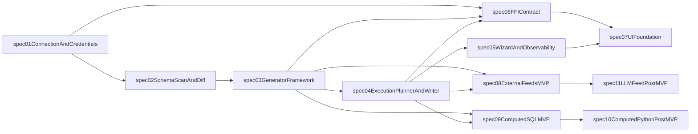

# LoomiDBX Specs 总体规划（冻结版）

## 1. 目标与冻结范围

本文用于冻结 LoomiDBX 编码阶段的 Specs 拆分方案，覆盖：

- 11 个 specs 的命名（ID + slug + 标题）
- 每个 spec 的职责边界（包含 / 不包含）
- 每个 spec 的间断功能描述（阶段断点与接续关系）
- specs 之间的依赖关系与实施顺序

冻结口径：

- 当前版本采用“按能力域拆分 + 覆盖 MVP 与 Post-MVP”。
- MVP 不包含 Python 计算字段与 LLM 数据供给能力。
- Post-MVP specs 继续沿用同一套依赖关系，仅扩展能力，不回改 MVP 语义。

---

## 2. 命名规则（冻结）

- 统一格式：`spec-XX-<slug>`
- `XX` 为两位数字，按主依赖顺序编号
- slug 使用小写 kebab-case，避免歧义和重复

---

## 3. 11 个 Specs 清单（命名、边界、间断功能、依赖）

### spec-01-connection-and-credentials

- **名称**：连接与凭据管理
- **包含**：连接创建/编辑/测试、连接持久化、密钥环与环境变量注入策略
- **不包含**：Schema 扫描、生成器配置、执行引擎逻辑
- **间断功能描述**：交付“可稳定连接与安全存储凭据”，不向下承诺扫描与生成能力；`spec-02` 在此基础上接入扫描
- **上游依赖**：无
- **下游影响**：`spec-02`、`spec-06`、`spec-07`

### spec-02-schema-scan-and-diff

- **名称**：Schema 扫描、Diff 与重扫
- **包含**：全库/单表扫描、Schema 持久化、Diff 计算与确认
- **不包含**：字段生成规则执行、数据写入事务
- **间断功能描述**：交付“结构可识别、变化可追踪”；仅产出结构与差异，不负责数据生成，交由 `spec-03/04`
- **上游依赖**：`spec-01`
- **下游影响**：`spec-03`、`spec-04`、`spec-05`、`spec-07`

### spec-03-generator-framework

- **名称**：生成器框架与字段规则
- **包含**：Generator 接口、注册机制、类型生成器、字段级配置、预览接口
- **不包含**：跨表执行编排、批量写入与回滚
- **间断功能描述**：交付“单字段/单表层面的可生成能力”；跨表顺序与事务一致性由 `spec-04` 接续
- **上游依赖**：`spec-02`
- **下游影响**：`spec-04`、`spec-06`、`spec-08`、`spec-09`

### spec-04-execution-planner-and-writer

- **名称**：执行规划与批量写入引擎
- **包含**：依赖图、拓扑排序、行数协调、批量事务写入、失败停止与回滚策略
- **不包含**：UI 向导交互细节、FFI 展示层
- **间断功能描述**：交付“可执行的数据生成流水线”；交互体验与可观测呈现由 `spec-05/07` 接续
- **上游依赖**：`spec-03`
- **下游影响**：`spec-05`、`spec-06`、`spec-08`、`spec-09`

### spec-05-generation-wizard-and-run-observability

- **名称**：生成向导与运行可观测性
- **包含**：向导选表/行数配置、进度状态模型、运行历史模型与查询
- **不包含**：底层生成算法与数据库连接细节
- **间断功能描述**：交付“可操作、可追踪的执行体验”；执行内核仍依赖 `spec-04`
- **上游依赖**：`spec-04`
- **下游影响**：`spec-07`

### spec-06-ffi-contract

- **名称**：Go/Flutter FFI 契约
- **包含**：JSON 请求/响应契约、错误模型、内存释放约束、接口版本策略
- **不包含**：具体 UI 布局与业务流程实现
- **间断功能描述**：交付“可稳定联调的边界接口”；UI 成型与用户流程由 `spec-07` 接续
- **上游依赖**：`spec-01`、`spec-03`、`spec-04`
- **下游影响**：`spec-07`

### spec-07-ui-foundation

- **名称**：桌面 UI 基础与主流程
- **包含**：三栏布局、连接树、表配置主界面、向导入口、状态反馈
- **不包含**：Post-MVP 的高级表达式与 LLM 交互细节
- **间断功能描述**：交付“MVP 可用的端到端操作界面”；高级能力入口预留给 `spec-10/11`
- **上游依赖**：`spec-06`、`spec-05`
- **下游影响**：`spec-10`、`spec-11`（仅入口复用）

### spec-08-external-feeds-mvp

- **名称**：外部数据源（MVP）
- **包含**：文件/HTTP/SQL 三类 feed、认证策略、硬失败语义、出网确认
- **不包含**：LLM 供给与提示词编排
- **间断功能描述**：交付“非 LLM 外部供给闭环”；AI/LLM 能力由 `spec-11` 接续
- **上游依赖**：`spec-03`、`spec-04`
- **下游影响**：`spec-11`

### spec-09-computed-sql-mvp

- **名称**：SQL 计算字段（MVP）
- **包含**：`${column}` 引用规范、字段 DAG、SQL 校验与执行顺序
- **不包含**：Python 表达式沙箱与运行时
- **间断功能描述**：交付“SQL 计算字段可用”；Python 表达式在 `spec-10` 增量扩展，不回改 SQL 语义
- **上游依赖**：`spec-03`、`spec-04`
- **下游影响**：`spec-10`

### spec-10-postmvp-computed-python

- **名称**：Python 计算字段（Post-MVP）
- **包含**：Python 表达式求值、沙箱安全策略、超时/资源限制
- **不包含**：LLM 供给与内容生成
- **间断功能描述**：在 `spec-09` 已有 DAG 与表达式框架上扩展 Python 能力，属于“后续增强”，不阻塞 MVP 发布
- **上游依赖**：`spec-09`
- **下游影响**：无（可独立发布）

### spec-11-postmvp-llm-feed

- **名称**：LLM 数据供给（Post-MVP）
- **包含**：OpenAI 协议兼容供给、模型配置、调用边界与审计
- **不包含**：MVP 性能承诺口径内的吞吐指标
- **间断功能描述**：在 `spec-08` 外部 feed 基座上扩展 AI 供给类型，作为能力增量，不改变 MVP 硬失败与安全基线
- **上游依赖**：`spec-08`
- **下游影响**：无（可独立发布）

---

## 4. 依赖关系总览（冻结）

---

## 5. 实施批次建议（按冻结依赖执行）

- **Batch A（基础底座）**：`spec-01`、`spec-02`、`spec-03`
- **Batch B（执行闭环）**：`spec-04`、`spec-05`、`spec-06`
- **Batch C（MVP 完整体验）**：`spec-07`、`spec-08`、`spec-09`
- **Batch D（Post-MVP 增量）**：`spec-10`、`spec-11`

---

## 6. 变更控制（冻结后）

- 任何新增 spec 必须追加编号，不允许重排既有编号。
- 任何边界变更必须在对应 spec 的 `requirements.md` 与 `design.md` 同步记录“变更原因/影响面”。
- 若 `spec-09` 或 `spec-08` 的核心语义改变，必须同步评审 `spec-10/11` 依赖关系。

---

## 7. 落地动作清单（下一步）

1. 在 `.kiro/specs/` 下按本文件的 11 个命名初始化目录。  
2. 先完成 Batch A 的 `requirements.md`，通过后进入 `design.md`。  
3. 每个 spec 的 `tasks.md` 必须包含测试任务与跨 spec 联调任务。  

