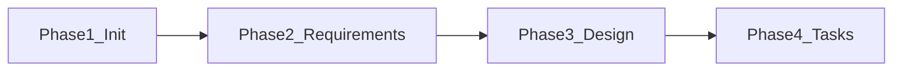

项目构建日志

# 1. 项目初始化

已按计划完成初始化，摘要如下。

## Go 后端

- 根目录 `go.mod`：module loomidbx，依赖 github.com/json-iterator/go。
- `backend/cmd/main.go`：LDB_Version（返回 JSON）、LDB_FreeString，供 c-shared 导出。
- 已建立 steering 中的子包占位：connector、schema、generator（含 int/、string/、decimal/、datetime/、boolean/）、writer、storage、ffi。
- 语言限制：int、string 不能作为包名，目录仍叫 int/string，包名分别为 intgen、strgen（见对应 doc.go）。

编译输出目录：`backend/build/libldb.dll`（及同目录生成的 .h）。一键脚本：`scripts/build-go-windows.ps1`。

## Flutter 前端

- frontend/：flutter create 含 windows / macos / linux。
- `pubspec.yaml`：flutter_riverpod；主题色与 steering 主色一致（#2563EB）。
- `lib/main.dart`：ProviderScope + LoomiDBXApp。
- 已建目录：ffi/（native_library.dart 预留 DynamicLibrary.open）、models/、screens/、widgets/、providers/。
- Windows 资源：`windows/runner/Runner.rc` 中公司名改为 com.aierdong.loomidbx。
- 为兼容当前环境（Flutter 3.3 / Dart 2.18），未使用 ColorScheme.fromSeed / Material 3 等较新 API。

## 仓库

已扩展 `.gitignore`（backend/build/、**/build/、.dart_tool/ 等）。

## 已执行验证

| 命令                                                                    |	结果 |
| :--------------------------------------------------------------------- | :--- |
| go build -buildmode=c-shared -o backend/build/libldb.dll ./backend/cmd | 通过  |
| go test ./...                                                          | 通过  |
| flutter analyze                                                        | 无问题 |
| flutter test                                                           | 通过  |
| flutter build windows                                                  | 通过  |

本地可执行：`cd frontend` 后 `flutter run -d windows`（需本机 Flutter 在 PATH 或使用 D:\flutter\bin\flutter.bat）。
DLL 联调时请将 backend/build/libldb.dll 放到与 loomidbx.exe 同目录或按 native_library.dart 调整加载路径。 
所有相关 to-do 已勾选完成。
若你希望下一步把 CMake 里自动复制 libldb.dll 到 runner 输出目录，可以说一下我按 Windows 流程补上。 

# spec-01-connection-and-credentials 的 Quick Spec 执行计划

## 关键约束（与默认 spec-quick 的差异）

- **目录名必须冻结为** `spec-01-connection-and-credentials`（见 [SPECS_PLANNING.md](e:\git\loomidbx\SPECS_PLANNING.md) 第 2、3 节）。若仅用一句英文描述走「自动 kebab」，通常得不到带 `spec-01-` 前缀的名称，**阶段 1 应直接以该名字创建目录与文件**，勿依赖从长描述推导出的 slug。
- **`PROJECT_DESCRIPTION`**（写入 `[requirements-init.md](e:\git\loomidbx\.kiro\settings\templates\specs\requirements-init.md)` 占位）建议用**中文**概括以下内容，便于 `/kiro:spec-requirements` 生成与规划一致的需求：
  - **名称**：连接与凭据管理
  - **包含**：连接创建/编辑/测试、连接持久化、密钥环与环境变量注入策略
  - **不包含**：Schema 扫描、生成器配置、执行引擎逻辑
  - **间断交付**：可稳定连接与安全存储凭据；明确不向下承诺扫描与生成（`spec-02` 接续）
  - **依赖**：上游无；下游 `spec-02`、`spec-06`、`spec-07`（便于需求/设计中的范围与衔接说明）
- **语言**：模板 `[init.json](e:\git\loomidbx\.kiro\settings\templates\specs\init.json)` 默认 `"language": "zh"`，生成物与总结保持简体中文（符合 CLAUDE.md / spec.json）。
- **规划第 7 节对 `tasks.md` 的硬性要求**：必须包含**测试任务**与**跨 spec 联调**任务；阶段 4 完成后需人工核对 `[tasks.md](e:\git\loomidbx\.kiro\settings\templates\specs\tasks.md)` 结构下是否覆盖与 `spec-02`/`spec-06`/`spec-07` 的边界假验。

## 执行流程（对应 `/spec-quick --auto` 四阶段）

### 阶段 1：初始化

- 确认 `[.kiro/specs/](e:\git\loomidbx\.kiro\specs)` 下不存在同名目录（若已存在则按冲突策略改为 `-2` 后缀，**优先使用规划名不重命名**）。
- 创建目录 `.kiro/specs/spec-01-connection-and-credentials/`（当前环境为 Windows PowerShell，使用 `New-Item -ItemType Directory -Force` 或等价方式；**避免**用 `&&` 串联命令）。
- 读取并填充模板：
  - `[init.json](e:\git\loomidbx\.kiro\settings\templates\specs\init.json)` → `spec.json`（`{{FEATURE_NAME}}` → `spec-01-connection-and-credentials`，`{{TIMESTAMP}}` 为 UTC ISO8601，例如 `Get-Date` 格式化为 `yyyy-MM-ddTHH:mm:ssZ`）
  - `[requirements-init.md](e:\git\loomidbx\.kiro\settings\templates\specs\requirements-init.md)` → `requirements.md`（`{{PROJECT_DESCRIPTION}}` 为上方中文规划摘要）
- 产出：`spec.json`、`requirements.md`（需求正文待阶段 2 生成）。

### 阶段 2：生成需求（等价 `/kiro:spec-requirements spec-01-connection-and-credentials`）

- 按 `[.cursor/commands/kiro/spec-requirements.md](e:\git\loomidbx\.cursor\commands\kiro\spec-requirements.md)` 步骤：
  - 读取 `.kiro/steering/` 全文（含 `product.md`、`tech.md`、`structure.md` 及自定义 steering）
  - 阅读 `[.kiro/settings/rules/ears-format.md](e:\git\loomidbx\.kiro\settings\rules\ears-format.md)` 与 `[.kiro/settings/templates/specs/requirements.md](e:\git\loomidbx\.kiro\settings\templates\specs\requirements.md)`
  - 编写完整 `requirements.md`（EARS、可测、**标题需数字编号**），**不写实现细节**
  - 更新 `spec.json`：`phase: "requirements-generated"`，`approvals.requirements.generated: true`，`updated_at`
- 技术栈对齐要点（来自 steering，供需求表述用，不单写实现）：Flutter + Go FFI、连接在 Go 侧、`LDB_` 前缀、配置存储（如 SQLite）等见 `[tech.md](e:\git\loomidbx\.kiro\steering\tech.md)`。

### 阶段 3：生成设计（等价 `/kiro:spec-design spec-01-connection-and-credentials -y`）

- 按 `[.cursor/commands/kiro/spec-design.md](e:\git\loomidbx\.cursor\commands\kiro\spec-design.md)`：加载 steering、需求、[design 模板](e:\git\loomidbx.kiro\settings\templates\specs\design.md)、[design-principles.md](e:\git\loomidbx.kiro\settings\rules\design-principles.md)；`-y` 表示自动批准需求。
- 输出 `design.md`：组件/模块、凭据存储与注入策略、连接生命周期、与后续 spec 的接口边界（例如为未来 schema 扫描预留的连接抽象，但不实现扫描）。
- 更新 `spec.json` 中 design 相关元数据与时戳（以命令内「Update Metadata」为准）。

### 阶段 4：生成任务（等价 `/kiro:spec-tasks spec-01-connection-and-credentials -y`）

- 按 `[.cursor/commands/kiro/spec-tasks.md](e:\git\loomidbx\.cursor\commands\kiro\spec-tasks.md)`：读取 `[tasks-generation.md](e:\git\loomidbx\.kiro\settings\rules\tasks-generation.md)`、[`tasks.md` 模板](e:\git\loomidbx.kiro\settings\templates\specs\tasks.md)；`-y` 自动批准需求与设计。
- **显式验收**：`tasks.md` 中须含**单元/集成测试类任务**以及**与下游 spec 的联调/契约验证类任务**（例如：连接与凭据就绪后，对 `spec-02` 扫描入口的假验或 mock 契约；对 `spec-06` FFI 错误模型预留的衔接检查），以满足 [SPECS_PLANNING.md 第 7 节第 3 条](e:\git\loomidbx\SPECS_PLANNING.md)。

## Quick 模式说明与后续

- 本流程**跳过** `/kiro:validate-gap` 与 `/kiro:validate-design`（与 `/spec-quick` 说明一致）；完成后建议视复杂度补做 gap/design 校验再进入 `/kiro:spec-impl`。
- **规划第 7 节第 1 条**（11 个目录一次性初始化）与「只完成 spec-01」可拆：**本计划仅交付 spec-01 全套文档**；若需严格同步「11 个空目录」可另起一小步批量建空目录（不改变 spec-01 内容）。

## 产出清单（完成时）

| 文件                                                         | 说明                             |
| :---------------------------------------------------------- | :------------------------------- |
| `.kiro/specs/spec-01-connection-and-credentials/spec.json`   | 元数据与阶段状态                 |
| `.kiro/specs/spec-01-connection-and-credentials/requirements.md` | EARS 需求                        |
| `.kiro/specs/spec-01-connection-and-credentials/design.md`   | 技术设计                         |
| `.kiro/specs/spec-01-connection-and-credentials/tasks.md`    | 实现任务（含测试与跨 spec 联调） |

规划内工作已全部做完，摘要如下。

## Quick Spec 已完成（自动等效全流程）

模式说明：按冻结目录名 `.kiro/specs/spec-01-connection-and-credentials/` 完成初始化 → 需求 → 设计（`-y`）→ 任务（`-y`），未执行 gap/design 校验。

### 产出文件

| 文件                                                         | 说明                                                         |
| :----------------------------------------------------------- | :----------------------------------------------------------- |
| `.kiro/specs/spec-01-connection-and-credentials/spec.json`   | `phase: tasks-generated`，需求/设计已批准（`-y`），任务已生成待评审 |
| `.kiro/specs/spec-01-connection-and-credentials/requirements.md` | 5 组需求，EARS 风格验收条款，编号 1.x～5.x                   |
| `.kiro/specs/spec-01-connection-and-credentials/design.md`   | 架构边界、组件、数据与错误策略；对齐 `docs/schema.md` / steering |
| `.kiro/specs/spec-01-connection-and-credentials/research.md` | 调研与决策摘要                                               |
| `.kiro/specs/spec-01-connection-and-credentials/tasks.md`    | 6 大组任务；含 5.x 测试 与 6.x 跨 spec-02/06/07 联调；文末有需求覆盖矩阵 |

### Quick 生成阶段未跑的校验

- `/kiro:validate-gap spec-01-connection-and-credentials`
- `/kiro:validate-design spec-01-connection-and-credentials`

### 建议后续步骤

1. 人工过一遍 `design.md`（尤其是删除连接的从属策略与 `extra` 扩展）。
2. 可选：补跑上述 validate 命令。
3. 实现阶段：`/kiro:spec-impl spec-01-connection-and-credentials`（或按 `tasks.md` 子任务分段执行）。

所有相关 to-do 已标为 completed。