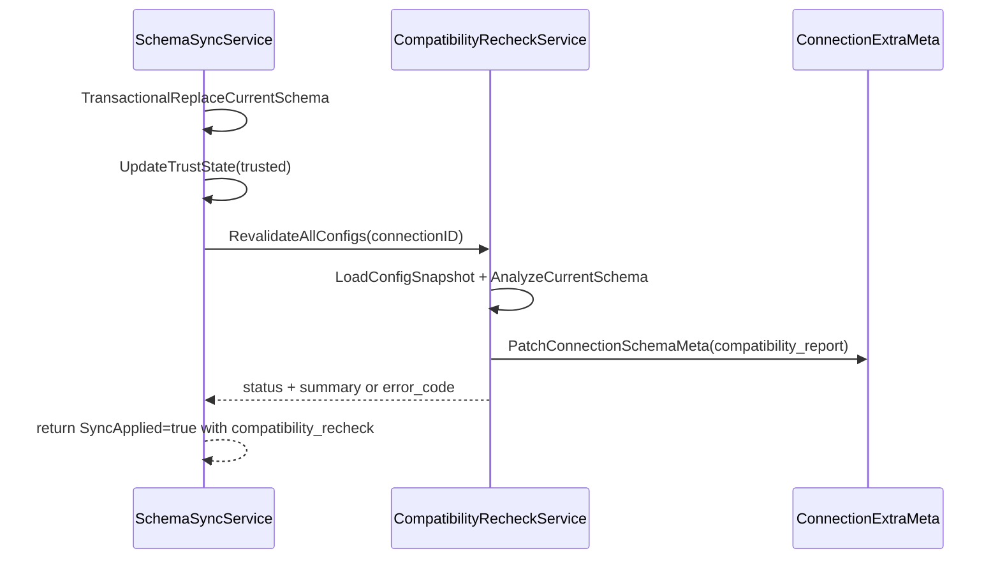

# CompatibilityRecheck 落地计划

## 已确认的设计决策
- `ApplySchemaSync` 与重判定解耦：schema 落库成功即视为同步成功；重判定失败仅记录状态并可后续重试。
- 报告落库采用 latest-only：仅保存最新快照到 `ldb_connections.extra` 的 schema 子域，不建新表。

## 目标行为（契约）
- `ApplySchemaSync` 成功返回时附带 `compatibility_recheck` 子对象，至少包含：
  - `status`: `success | failed | skipped_no_generator_config`
  - `generated_at_unix`
  - `summary`: `mode / total_risks / blocking_risks`
  - `error_code`（仅 `failed` 时）
- 重判定结果（最新快照）持久化在连接 `extra`，供读取接口直接返回。
- `GetSchemaTrustState` 响应扩展 `compatibility_report`（latest snapshot），避免新增 FFI 接口。

## 数据流


## 实施步骤
1. 扩展 connection extra schema 子域模型
- 修改 [backend/schema/connection_extra_meta.go](backend/schema/connection_extra_meta.go)：新增 `compatibility_report` 相关 key/结构（latest snapshot + recheck status/summary）。
- 修改 [backend/schema/connection_extra_meta_test.go](backend/schema/connection_extra_meta_test.go)：覆盖 parse/merge、字段清空、保留无关键场景。

2. 定义重判定结果与服务依赖契约
- 修改 [backend/schema/compatibility_recheck_service.go](backend/schema/compatibility_recheck_service.go)：
  - 将接口由仅 `error` 扩展为返回结构化结果（`status/summary/error_code`）。
  - 保留 `Noop`（返回 `skipped_no_generator_config`），新增真实实现骨架。
- 修改 [backend/schema/schema_sync_service.go](backend/schema/schema_sync_service.go)：接收结构化返回并写入 `ApplySchemaSyncResult`，不再因重判定失败返回 `SchemaSyncError`。

3. 实现“基于当前 schema 的全量重判定”
- 在 [backend/schema/generator_compatibility_risks.go](backend/schema/generator_compatibility_risks.go) 增补“按连接当前 schema + 配置快照”分析路径（不依赖 task diff）。
- 扩展配置快照最小字段（至少包含 `generator_type`），支持判断“当前字段候选集合是否仍包含已选生成器”。
- 输出风险列表沿用 `GeneratorCompatibilityRisk`，并生成 summary。

4. 落库与读取链路打通
- 在 [backend/schema/schema_trust_gate.go](backend/schema/schema_trust_gate.go) 及实现中，补充对 `compatibility_report` 的 patch/read 能力（保持兼容旧 extra）。
- 修改 [backend/ffi/schema_json_adapter.go](backend/ffi/schema_json_adapter.go)：
  - `ApplySchemaSync` 返回新增 `compatibility_recheck`。
  - `GetSchemaTrustState` 返回 `compatibility_report` latest snapshot。

5. 测试与回归
- 修改 [backend/schema/schema_sync_service_test.go](backend/schema/schema_sync_service_test.go)：
  - 同步成功 + 重判定失败时：`SyncApplied=true`、返回 `compatibility_recheck.status=failed`、无 FFI 级错误。
- 修改 [backend/schema/schema_scan_service_test.go](backend/schema/schema_scan_service_test.go)：验证端到端路径新契约。
- 修改 [backend/ffi/schema_json_adapter_test.go](backend/ffi/schema_json_adapter_test.go)：新增 JSON 契约断言。
- 修改 [backend/ffi/schema_integration_chain_test.go](backend/ffi/schema_integration_chain_test.go)：验证同步响应与 trust-state 读取的一致性。

## 兼容性与迁移策略
- 旧 `extra` 无 `compatibility_report` 时按空快照处理。
- 旧调用方若只读取 `sync_applied/trust_state` 不受影响；新增字段为向后兼容扩展。
- `NoopCompatibilityRecheckService` 继续保留，便于依赖未就绪场景逐步切换。

[ ] 扩展 connection extra 的 compatibility_report 最新快照结构与解析合并逻辑

[ ] 升级 CompatibilityRecheckService/ApplySchemaSyncResult 为结构化重判定状态返回

[ ] 实现基于当前 schema 的全量重判定与 summary 产出

[ ] 将 compatibility_recheck/compatibility_report 接入 ApplySchemaSync 与 GetSchemaTrustState JSON 响应

[ ] 补齐 schema/ffi/集成测试覆盖成功、失败、兼容旧数据场景


本次实现结果：

- `CompatibilityRecheckService` 从 `error` 返回升级为结构化快照返回：`(CompatibilityReportSnapshot, error)`，并保留 `Noop`（返回 `skipped_no_generator_config`）。

- 扩展了

   

  ```
  connection extra
  ```

   

  的 schema 子域：

  - 新增 `compatibility_report`（latest-only 快照）
  - 新增模型：`CompatibilityRecheckStatus`、`CompatibilityReportSummary`、`CompatibilityReportSnapshot`
  - `Parse/Merge` 已兼容旧数据并保证 `risks` 非 `nil`。

- ```
  ApplySchemaSync
  ```

   

  改为“同步成功与重判定解耦”：

  - schema 同步成功后即 `SyncApplied=true`
  - 重判定失败不再返回 `SchemaSyncError`，而是在返回体 `compatibility_recheck.status=failed` + `error_code=COMPATIBILITY_RECHECK_FAILED`

- 新增真实重判定实现（放在app层，避免 schema<->generator 循环依赖）：

  - 文件：`backend/app/compatibility_recheck_service_impl.go`
  - 逻辑：基于当前 schema + 生成器配置快照全量重判定
  - 判定输出：阻断风险列表 + summary
  - 落库：写回 `ldb_connections.extra.compatibility_report`
  - 阻断风险时联动 trust state 到 `pending_adjustment`

- FFI 契约已贯通：

  - `ApplySchemaSync` 成功响应包含 `sync_applied`、`trust_state`、`compatibility_recheck`
  - `GetSchemaTrustState` 响应包含 `compatibility_report`

- 测试补齐：

  - `connection_extra_meta` parse/merge roundtrip 与默认值场景
  - `schema_sync_service`：新增“重判定失败不影响同步成功”断言
  - `ffi/schema_json_adapter_test`：新增 `compatibility_recheck` / `compatibility_report` 契约断言
  - `app/compatibility_recheck_service_impl_test`：新增真实重判定核心路径（无配置、类型不兼容+trust联动）

验证结果：

- 在 `backend` 目录执行 `go test ./...` 全量通过。

当前已经全部继续完毕，状态如下：

- 所有计划 To-do 都已标记为 completed
- 代码实现已完成并验证：
  - `CompatibilityRecheckService` 已从 Noop-only 升级为结构化返回契约
  - 同步后重判定与同步主流程已解耦（失败不回滚同步成功）
  - latest-only 报告已落到 `ldb_connections.extra.compatibility_report`
  - `ApplySchemaSync` / `GetSchemaTrustState` 的 FFI 返回契约已扩展
  - 真实重判定实现已落到 `backend/app/compatibility_recheck_service_impl.go`
- 回归验证：
  - `backend` 下 `go test ./...` 已全量通过（最近一轮 exit code 0）
