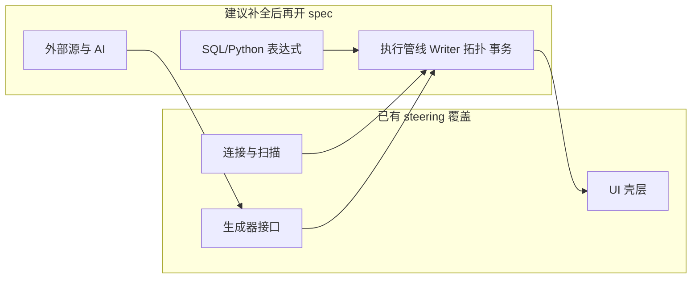

# Spec 设计前建议补齐的研究课题

## 已相对饱和的方向

- **连接、元数据模型、扫描/Diff、AutoMap、FFI 清单**：以 [docs/schema.md](docs/schema.md) 为权威、[database-schema.md](.kiro/steering/database-schema.md) 为摘要，可支撑连接与配置类 spec。
- **生成器接口、注册表、类型体系、实现优先级**：[generator.md](.kiro/steering/generator.md) 已能支撑「单字段/批量预览」类 spec。
- **桌面端布局与组件级 UI**：[ui.md](.kiro/steering/ui.md) 与 [docs/ui/UI_DESIGN.md](docs/ui/UI_DESIGN.md) 可支撑界面 spec 的骨架。

## 建议在 spec 之前重点研究/成文的课题

### 1. 生成执行管线（Orchestration + Writer）— 最大缺口

产品大纲 [§8.5](product-outline.md)（向导、表选择、外键倍数、进度、历史记录）与 [structure.md](.kiro/steering/structure.md) 中的 `writer/`、拓扑排序、事务边界，**尚未**与「连接/扫描」同级沉淀为一份 steering 或独立详设。

建议事先澄清并文档化：

- **依赖图**：物理外键 + 逻辑外键 + 用户勾选表集合 → 生成顺序（拓扑）；**环**与**可选表**时的产品策略（禁止生成 / 提示拆批 / 仅允许部分关系类型）。
- **行数协调**：`table_relations` 与向导中 1:1、1:N 倍数区间如何落到统一「行数计划」；多对多与中间表的处理。
- **写入策略**：批量大小、每批事务、失败是否全任务回滚或「已提交批次保留」、Truncate 与 FK 禁用顺序（若适用）。
- **运行期可观测性**：进度与日志的 FFI 形态（一次性结果 vs 流式回调）、取消/超时。
- **运行历史**：大纲要求「记录本次生成…备查」— 元数据表字段、与 `scan_history` 的边界。

该块是「从规则到真实库里有数据」的核心，缺它容易导致 spec 只覆盖配置界面而漏掉执行引擎。

### 2. 表达式与计算字段子系统

大纲与 [tech.md](.kiro/steering/tech.md) 同时提到 **SQL 表达式** 与 **Python（gpython）**。

需研究：

- **求值顺序**：多计算字段、相互引用时的 DAG 与错误信息。
- **SQL 方言**：表达式是按目标库解析还是在抽象层限定函数子集。
- **Python 沙箱**：允许的标准库范围、禁用项、性能上限（避免生成阻塞）。

### 3. 外部数据源与 AI 生成

大纲列举 REST、JSON、公开数据集、**AI 生成**（如电影名）。当前 steering 对 **网络访问、认证、缓存、失败降级、隐私与密钥管理** 缺少统一策略。

需决定：MVP 是否包含 AI；若包含，提供商、密钥存储、离线/限流、与桌面端合规表述。

### 4. 唯一性与约束在「批量插入」下的语义

[generator.md](.kiro/steering/generator.md) 已有 `Unique` 与 `UniquePool` 方向，但产品成功标准强调约束满足。需明确：

- 唯一性在内存中保证还是依赖插入失败重试；
- 与目标库唯一索引冲突时的用户可见行为。

### 5. 文档与约定的一致性（避免 spec 引用冲突）

- [tech.md](.kiro/steering/tech.md) 写元数据表 `ldb_*` 前缀，而 [docs/schema.md](docs/schema.md) / steering 使用 `connections` 等无前缀表名 — **应在开 spec 前统一**（以单一权威文档为准并修正另一处）。

### 6. MVP 范围与 spec 切片策略

[tech.md](.kiro/steering/tech.md) 已列出数据库支持阶段（Phase 1–3）。建议在 spec 前明确 **第一条垂直切片**（例如：仅 SQLite 目标 + 本地元数据 + 有限生成器 + 无 AI），以便 requirements/design 不写散。

### 7. 可选的次要课题（可按优先级后置）

- **国际化**：界面语言范围（仅中文 vs 中英）与生成器「中国语境」默认是否写进 spec。
- **测试策略**：集成测试是否绑定 Docker 中的 MySQL/Postgres、是否作为 spec 验收标准。
- **安全与运维**：除连接密码加密外，是否强调「生产库危险操作」提示、只读连接模式等（若产品需要）。

---

## 小结

三份 steering 已很好覆盖 **元数据侧** 与 **生成器微观模型** 与 **壳层 UI**。在写 spec 前，最值得先「研究清楚并落成文档」的是 **§1 生成执行管线**（与 §2 表达式联动），其次是 **§3 外部/AI** 与 **§4 约束语义**；**§5 命名一致性** 应用小成本先解决，避免 spec 引用两套表名。

